<!-- README.md is generated from README.Rmd. Please edit that file -->

# midr: Create an Interpretable Surrogate of Black-Box ML Models

<!-- badges: start -->
<!-- badges: end -->

The `midr` package is designed to provide a model-agnostic method for
interpreting black-box machine learning models by creating a globally
interpretable surrogate of the target model.  
The basic concepts underlying the package were developed as a functional
decomposition technique called *Maximum Interpretation Decomposition*
(MID).

## Installation

You can install the development version of `midr` from
[GitHub](https://github.com/) with:

``` r
# install.packages("devtools")
devtools::install_github("ryo-asashi/midr")
```

## Examples

The main function of the package is `interpret()`, which can be used to
fit a predictive model consisting of a set of functions, each with up to
two variables.

**Fitting an MID Model to the Data**

In the following example, we construct a model for the `price` of
diamonds whose prediction function is the sum of eleven component
functions: the *intercept* (or the zeroth-order effect), four
first-order *main effects* corresponding to each predictor variable
(`carat`, `clarity`, `color` and `cut`), and six second-order
*interactions* corresponding to each pair of the variables.

``` r
# required packages
library(midr)
library(ggplot2)
library(gridExtra)
library(ranger)
library(ISLR2)
# fit a two-dimensional MID model to the 'diamonds' data
data("diamonds", package = "ggplot2")
mid <- interpret(price ~ (carat + clarity + color + cut)^2, diamonds)
print(mid, omit.values = TRUE)
#> 
#> Call:
#> interpret(formula = price ~ (carat + clarity + color + cut)^2,
#>  data = diamonds)
#> 
#> Intercept: 3932.8
#> 
#> Main Effects:
#> 4 main effect terms
#> 
#> Interactions:
#> 6 interaction terms
#> 
#> Uninterpreted Rate: 0.025954
```

It is easy to visualize each component function of the fitted MID model.

``` r
# main effects
grid.arrange(grobs = mid.plots(mid, limits = NULL))
```

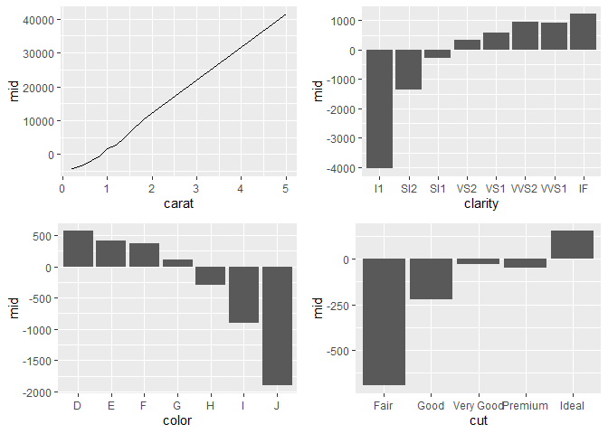

``` r
# interactions
interactions <- mid.terms(mid, main.effect = FALSE)
grid.arrange(grobs = mid.plots(mid, interactions, limits = NULL))
```

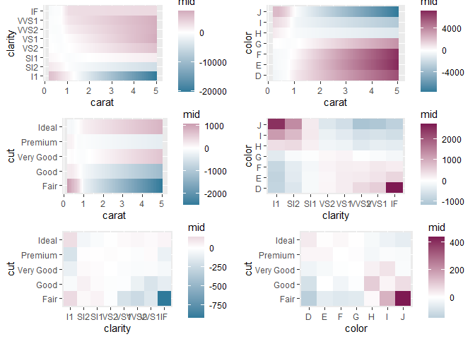

As another example, we fit a two-dimensional MID model of the
`Bikeshare` dataset included in `ISLR2`.

``` r
# Bikeshare dataset
data(Bikeshare, package = "ISLR2")
set.seed(42)
train_rows <- sample(nrow(Bikeshare), nrow(Bikeshare) * .75)
train <- Bikeshare[ train_rows, ]
valid <- Bikeshare[-train_rows, ]
# fit a two-dimensional model
mid <- interpret(bikers ~ (mnth + factor(workingday) + hr +
                 weathersit + temp + hum + windspeed)^2,
                 data = train, lambda = .01, link = "log")
```

The fitted MID model can be used to predict the number of bike rentals.

``` r
# predict the number of bike rentals
preds <- predict(mid, valid)
data.frame(actual = valid$bikers[1:12], predicted = preds[1:12])
#>    actual  predicted
#> 1       1   1.698922
#> 2      56  83.267957
#> 3      84  99.675279
#> 4      93  76.897362
#> 5      37  39.543823
#> 6      36  29.854763
#> 7       6   5.191190
#> 8       3   1.066977
#> 9      53  67.527428
#> 10     93 100.374671
#> 11     31  35.168873
#> 12      3   4.316623
```

``` r
# rmse loss
rmse <- function(x, y) {
  cat("RMSE:", format(sqrt(mean((x - y) ^ 2)), digits = 6), "\n")
}
rmse(valid$bikers, preds)
#> RMSE: 41.0327
```

``` r
# main effects
plots <- mid.plots(mid)
grid.arrange(grobs = plots[1:4], nrow = 2)
```

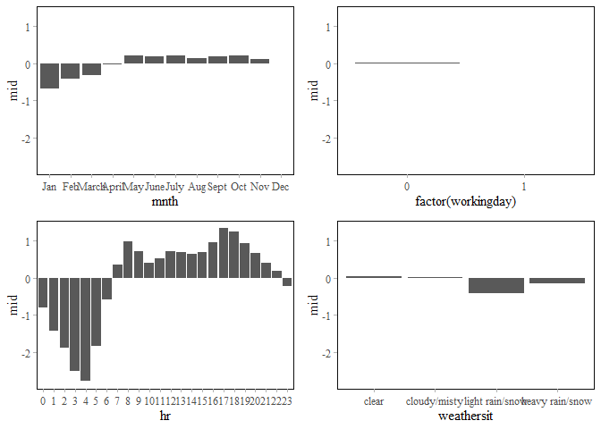

``` r
grid.arrange(grobs = plots[5:7], nrow = 1)
```

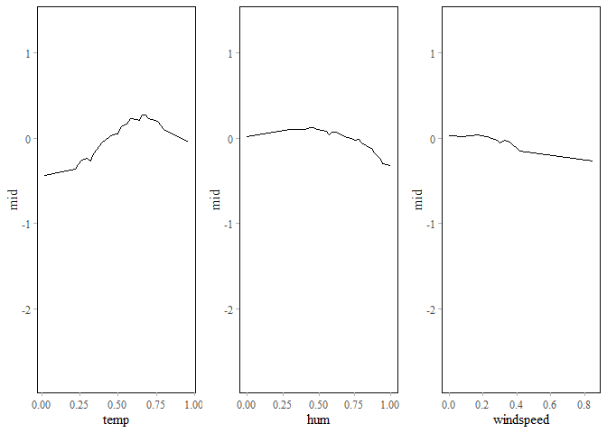

The importance of each term (or the corresponding component function) of
a MID model can be measured as the mean absolute effect of it. Drawing a
heatmap is a useful way to find important two-way interactions.

``` r
# draw a heatmap of term importance
ggmid(mid.importance(mid), type = "heatmap")
```

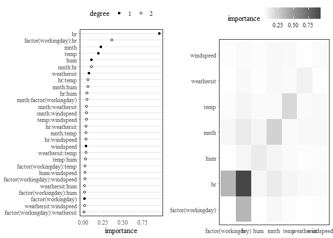

And in the visualization of the most important two-way interaction
between `hr` and `workingday`, we can see the difference in the hourly
pattern of bike rentals on weekdays and holidays due to the effect of
commuting.

``` r
# visualize the most important interaction effect
ggmid(mid, "hr:factor(workingday)", include.main.effects = TRUE)
```

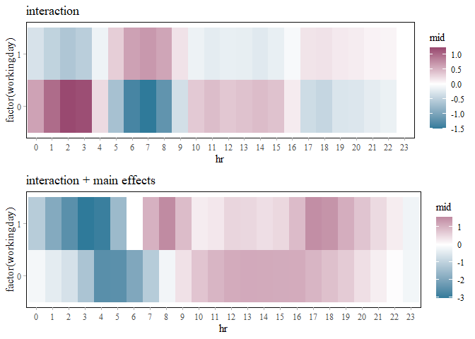

It is easy to generate *individual conditional expectation* (ICE) plots
for the fitted MID surrogate model.

``` r
# create a mid conditional object
ice_rows <- sample(nrow(valid), 200L)
mc <- mid.conditional(mid, "hr", data = valid[ice_rows,])
# visualize the individual conditional expectation
ggmid(mc, variable.colour = factor(workingday), alpha = .2)
```

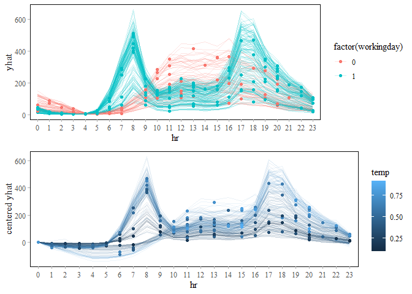

**Fitting a MID Model as a Global Surrogate of the Target Model**

In the next example, we construct a ranger model of `wage` based on the
`Wage` dataset in `ISLR2` and a MID surrogate of it.

``` r
# Wage dataset
data(Wage, package = "ISLR2")
set.seed(42)
train_rows <- sample(nrow(Wage), 2000)
train <- Wage[ train_rows, -10] # removing "logwage"
valid <- Wage[-train_rows, -10]
# construct ranger model with tuned parameters
set.seed(42)
model <- ranger(wage ~ ., train, importance = "permutation",
                num.trees = 1000, mtry = 3, min.node.size = 13,
                sample.fraction = .2281)
# RMSE loss
rmse(predict(model, valid)$predictions, valid$wage)
#> RMSE: 32.9839
```

When the target model is passed to the argument `model`, `interpret()`
replaces the response variable with the predicted values given by the
target model. Thus, the fitted MID model can be viewed as *an
interpretable model of the target model*.

``` r
# MID surrogae or the ranger model
mid <- interpret(wage ~ .^2, train, model = model, ok = TRUE)
print(mid, omit.values = TRUE)
#> 
#> Call:
#> interpret(formula = yhat ~ .^2, data = train, model = model,
#>  ok = TRUE)
#> 
#> Intercept: 112.54
#> 
#> Main Effects:
#> 9 main effect terms
#> 
#> Interactions:
#> 36 interaction terms
#> 
#> Uninterpreted Rate: 0.012007
```

``` r
# interpretation loss
rmse(predict(mid, valid), predict(model, valid)$predictions)
#> RMSE: 2.75629
```

To the extent that the MID model is acceptable as a surrogate for the
target model, we can use the former to understand the latter.

``` r
# main effects
grid.arrange(grobs = mid.plots(mid))
```

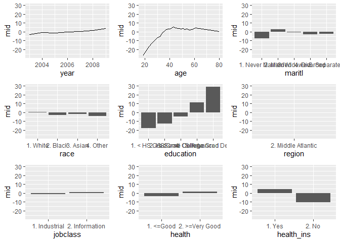

``` r
# custom plot for the most important interaction
ggmid(mid, term = "age:education", include.main.effects = TRUE)
```

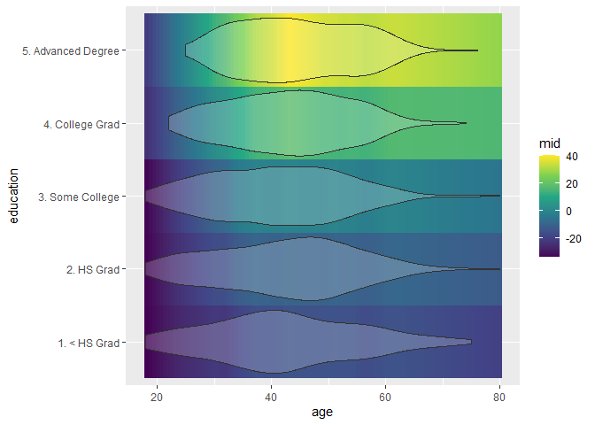

The following plot compares the term importance (TI) of the `midr`
surrogate with the *permutation feature importance* (PFI) of the target
`ranger` model.

``` r
# permutation feature importance of variables
imp <- sort(model$variable.importance, decreasing = FALSE)
imp <- data.frame(variable = factor(names(imp), levels = names(imp)),                   importance = imp)
# importance of the component terms
grid.arrange(nrow = 1,
  ggmid(mid.importance(mid), max.terms = 12) +
    labs(subtitle = "Surrogate Model (TI)"),
  ggplot(imp, aes(y = variable, x = importance)) +
    geom_col() + labs(subtitle = "Target Model (PFI)")
)
```

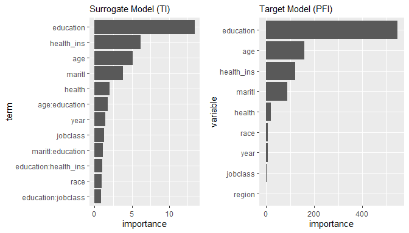

Because the prediction function of the MID model is a sum of the simple
component terms, the individual conditional effect can be decomposed
into the effects of each term.

``` r
# create a mid conditional object
mc <- mid.conditional(mid, "education", train)
# visualize the effects of each component function
mc$conditional$education <- as.numeric(mc$conditional$education)
grid.arrange(
  ggmid(mc, term = "age:education",
        variable.colour = age, draw.dots = FALSE),
  ggmid(mc, term = "maritl:education",
        variable.linetype = maritl, draw.dots = FALSE),
  ggmid(mc, term = "race:education",
        variable.linetype = race, draw.dots = FALSE),
  ggmid(mc, term = "education:health",
        variable.linetype = health, draw.dots = FALSE)
)
```

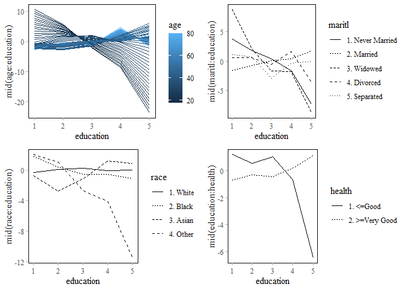
