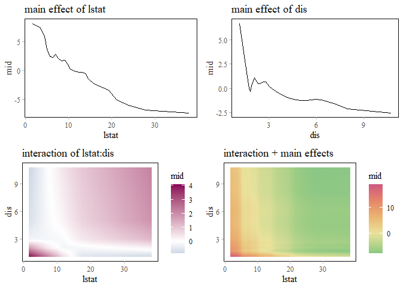
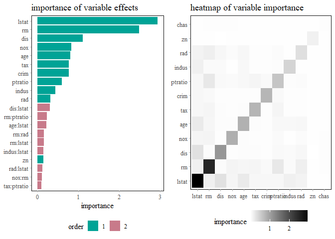
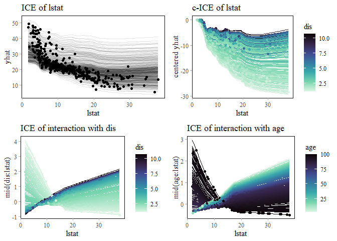

<!-- README.md is generated from README.Rmd. Please edit that file -->

# midr 

<!-- badges: start -->

[](https://github.com/ryo-asashi/midr/actions/workflows/R-CMD-check.yaml)
[](https://CRAN.R-project.org/package=midr)

<!-- badges: end -->

The **midr** package is designed to provide a model-agnostic method for
interpreting black-box machine learning models by creating a globally
interpretable surrogate of the target model using a functional
decomposition technique called *Maximum Interpretation Decomposition*
(MID).

For the theoretical details of MID, see Iwasawa & Matsumori (2025)
\[Forthcoming\], and for the technical details of the package, see
Asashiba et al. (2025) \[Forthcoming\].

## Installation

You can install the released version of `midr` from
[CRAN](https://cran.r-project.org/) with:

``` r
install.packages("midr") # not yet available
```

And the development version of `midr` from [GitHub](https://github.com/)
with:

``` r
# install.packages("devtools")
devtools::install_github("ryo-asashi/midr")
```

## Examples

In the following example, we fit a random forest model of `Boston`
dataset included in the ISLR2 package.

``` r
# load required packages
library(midr)
library(ggplot2)
library(gridExtra)
library(ISLR2)
library(ranger)
theme_set(theme_midr())
# split the Boston dataset
data("Boston", package = "ISLR2")
set.seed(42)
idx <- sample(nrow(Boston), nrow(Boston) * .75)
train <- Boston[ idx, ]
valid <- Boston[-idx, ]
# fit a random forest model
model_rf <- ranger(medv ~ ., train, mtry = 5)
preds_rf <- predict(model_rf, valid)$predictions
cat("RMSE: ", weighted.rmse(valid$medv, preds_rf))
#> RMSE:  3.351362
```

The main function of the package is `interpret()`, which can be used to
create a global surrogate of the random forest model using MID.

``` r
# fit a two-dimensional MID model
mid_rf <- interpret(medv ~ .^2, train, model_rf, lambda = .1)
print(mid_rf, omit.values = TRUE)
#> 
#> Call:
#> interpret(formula = yhat ~ .^2, data = train, model = model_rf,
#>  lambda = 0.1)
#> 
#> Intercept: 22.446
#> 
#> Main Effects:
#> 12 main effect terms
#> 
#> Interactions:
#> 66 interaction terms
#> 
#> Uninterpreted Rate: 0.016249
```

``` r
preds_mid <- predict(mid_rf, valid)
cat("\nRMSE: ", weighted.rmse(preds_rf, preds_mid))
#> 
#> RMSE:  1.106746
```

``` r
cat("\nRMSE: ", weighted.rmse(valid$medv, preds_mid))
#> 
#> RMSE:  3.306111
```

The graphing functions `ggmid()` and `plot()` can be used to visualize
the main effects and the interactions of the variables.

``` r
# visualize the main effects and interactions of the MID model
grid.arrange(
  ggmid(mid_rf, "lstat") +
    ggtitle("main effect of lstat"),
  ggmid(mid_rf, "dis") +
    ggtitle("main effect of dis"),
  ggmid(mid_rf, "lstat:dis") +
    ggtitle("interaction of lstat:dis"),
  ggmid(mid_rf, "lstat:dis", include.main.effects = TRUE) +
    ggtitle("interaction + main effects")
)
```



The `mid.importance()` function helps to compute and compare the
importance of main effects and interactions of the variables in the
whole data or for an instance.

``` r
# visualize the MID importance of the component functions
imp <- mid.importance(mid_rf)
ibd <- mid.importance(mid_rf, data = train[1L, ])
grid.arrange(
  nrow = 1L,
  ggmid(imp, max.bars = 16L, plot.main = FALSE) +
    geom_point(aes(shape = degree), size = 2L) +
    theme_midr(grid_type = "y") +
    theme(legend.position = "bottom") +
    scale_shape_manual(values = c(1, 16)) +
    ggtitle("importance of variable effects"),
  ggmid(ibd, max.bars = 16L) +
    aes(fill = mid > 0) +
    theme(legend.position = "bottom") +
    scale_fill_manual(values = c("#7e1952", "#2f7a9a")) +
    ggtitle("breakdown of a prediction")
)
```



The `mid.conditional()` function can be used to compute the ICE curves
(Goldstein et al. 2015) of the fitted MID model and the breakdown of the
ICE curves by main effects and interactions.

``` r
# visualize the ICE curves of the MID model
ice <- mid.conditional(mid_rf, "lstat", data = train)
grid.arrange(
  ggmid(ice, centered = TRUE, alpha = .1) +
    ggtitle("c-ICE of lstat"),
  ggmid(ice, term = "lstat", centered = TRUE) +
    ggtitle("c-ICE of main effect"),
  ggmid(ice, term = "lstat:dis", centered = TRUE, variable.colour = "dis", alpha = .1) +
    ggtitle("c-ICE of interaction with dis"),
  ggmid(ice, term = "lstat:age", centered = TRUE, variable.colour = "age", alpha = .1) +
    ggtitle("c-ICE of interaction with age")
)
```



## References

\[1\] Iwasawa, H. & Matsumori, Y. (2025). \[Forthcoming\]

\[2\] Asashiba, R., Kozuma, R. & Iwasawa, H. (2025). \[Forthcoming\]

\[3\] Goldstein, A., Kapelner, A., Bleich, J., & Pitkin, E. (2015).
“Peeking Inside the Black Box: Visualizing Statistical Learning With
Plots of Individual Conditional Expectation”. *Journal of Computational
and Graphical Statistics*, *24*(1), 44–65.
<https://doi.org/10.1080/10618600.2014.907095>
