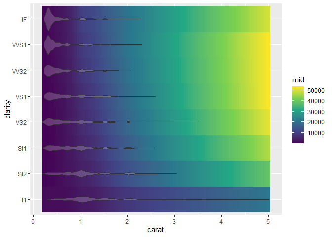
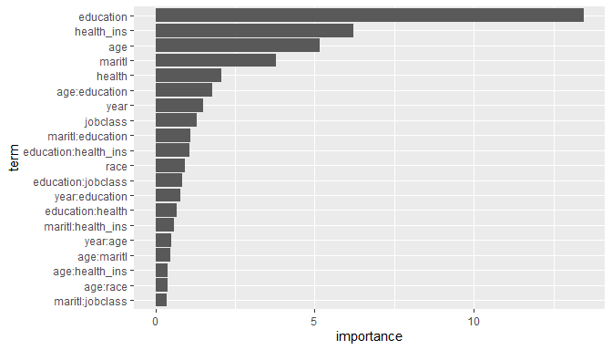
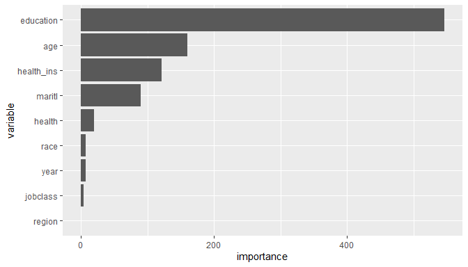
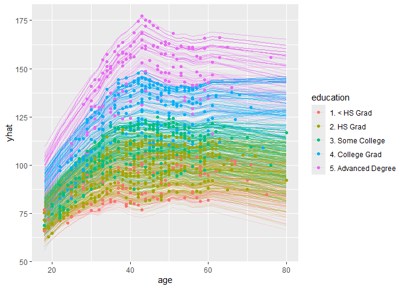
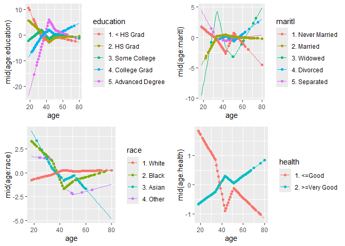

<!-- README.md is generated from README.Rmd. Please edit that file -->

# midr: Create an Interpretable Surrogate of Black-Box ML Models

<!-- badges: start -->
<!-- badges: end -->

The `midr` package is designed to provide a model-agnostic method for
interpreting black-box machine learning models by creating a globally
interpretable surrogate of the target model.  
The basic concepts underlying the package were developed as a functional
decomposition technique called *Maximum Interpretation Decomposition*
(MID).

## Installation

You can install the development version of `midr` from
[GitHub](https://github.com/) with:

``` r
# install.packages("devtools")
devtools::install_github("ryo-asashi/midr")
```

## Examples

The main function of the package is `interpret()`, which can be used to
fit a predictive model consisting of a set of functions, each with up to
two variables.

**Fitting an MID Model to the Data**

In the following example, we construct a model for the `price` of
diamonds whose prediction function is the sum of eleven component
functions: the *intercept* (or the zeroth-order effect), four
first-order *main effects* corresponding to each predictor variable
(`carat`, `clarity`, `color` and `cut`), and six second-order
*interactions* corresponding to each pair of the variables.

``` r
# required packages
library(midr)
library(ggplot2)
library(gridExtra)
library(ranger)
library(ISLR2)
# fit a two-dimensional MID model to the 'diamonds' data
data("diamonds", package = "ggplot2")
mid <- interpret(price ~ (carat + clarity + color + cut)^2, diamonds)
print(mid, omit.values = TRUE)
#> 
#> Call:
#> interpret(formula = price ~ (carat + clarity + color + cut)^2,
#>  data = diamonds)
#> 
#> Intercept: 3932.8
#> 
#> Main Effects:
#> 4 main effect terms
#> 
#> Interactions:
#> 6 interaction terms
#> 
#> Uninterpreted Rate: 0.025954
```

It is easy to visualize each component function of the fitted MID model.

``` r
# main effects
grid.arrange(grobs = mid.plots(mid, limits = NULL))
```


``` r
# interactions
interactions <- mid.terms(mid, main.effect = FALSE)
grid.arrange(grobs = mid.plots(mid, interactions, limits = NULL))
```


``` r
# custom visualization
ggmid(mid, "carat:clarity", scale.type = "viridis",
      add.intercept = TRUE, include.main.effects = TRUE) +
  geom_violin(data = diamonds, alpha = .2)
```



**Fitting a MID Model as a Global Surrogate of the Target Model**

In the next example, we construct a ranger model of `wage` based on the
`Wage` dataset in `ISLR2` and a MID surrogate of it.

``` r
# Wage dataset
data(Wage, package = "ISLR2")
set.seed(42)
train_rows <- sample(nrow(Wage), 2000)
train <- Wage[ train_rows, -10] # removing "logwage"
valid <- Wage[-train_rows, -10]
# construct ranger model with tuned parameters
set.seed(42)
model <- ranger(wage ~ ., train, importance = "permutation",
                num.trees = 1000, mtry = 3, min.node.size = 13,
                sample.fraction = .2281)
# RMSE loss
rmse <- function(x, y) {
  cat("RMSE :", format(sqrt(mean((x - y) ^ 2)), digits = 6), "\n")
}
rmse(predict(model, valid)$predictions, valid$wage)
#> RMSE : 32.9839
```

When the argument `model` is passed, `interpret()` replaces the values
of the response variable with the predicted values extracted from the
target model. Thus, the fitted MID model can be viewed as an
interpretable model of the target model.

``` r
# MID surrogae or the ranger model
mid <- interpret(wage ~ .^2, train, model = model, ok = TRUE)
print(mid, omit.values = TRUE)
#> 
#> Call:
#> interpret(formula = yhat ~ .^2, data = train, model = model,
#>  ok = TRUE)
#> 
#> Intercept: 112.54
#> 
#> Main Effects:
#> 9 main effect terms
#> 
#> Interactions:
#> 36 interaction terms
#> 
#> Uninterpreted Rate: 0.012007
```

``` r
# interpretation loss
rmse(predict(mid, valid), predict(model, valid)$predictions)
#> RMSE : 2.75628
```

To the extent that the MID model is acceptable as a surrogate for the
target model, we can use the former to understand the latter.

``` r
# main effects
grid.arrange(grobs = mid.plots(mid))
```


``` r
# custom plot for the most important interaction
ggmid(mid, term = "age:education",
      include.main.effects = TRUE, scale.type = "viridis") +
  geom_violin(data = train, alpha = .2)
```


The importance of each term (or the corresponding component function) of
a MID model can be measured as the mean absolute effect of it.

``` r
# importance of the component terms
autoplot(mid.importance(mid), max.terms = 20)
```



``` r
# permutation feature importance of variables
imp <- sort(model$variable.importance, decreasing = FALSE)
imp <- data.frame(variable = factor(names(imp), levels = names(imp)),                   importance = imp)
ggplot(imp, aes(y = variable, x = importance)) +
  geom_col()
```



It is also easy to create ICE plots for the fitted MID surrogate.

``` r
# create a mid conditional object
mc <- mid.conditional(mid, "age", train)
# visualize the individual conditional expectation
ggmid(mc, variable.colour = education, alpha = .2)
```



``` r
# visualize effects of the component function
ggmid(mc, term = "education:age", variable.colour = education,
      draw.dots = FALSE) +
  geom_point(size = 1)
```


