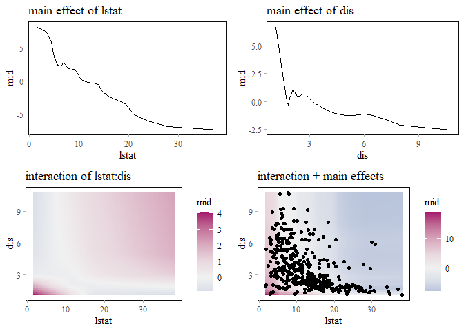
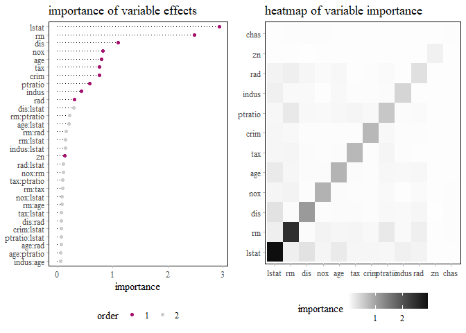
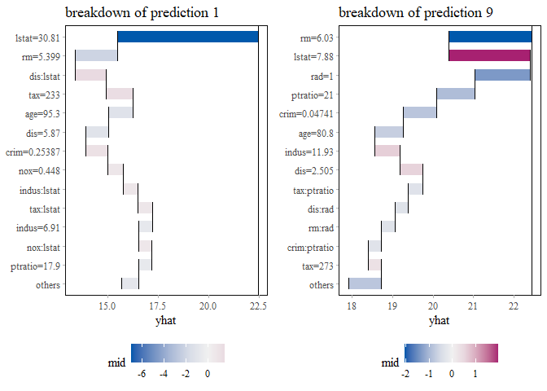
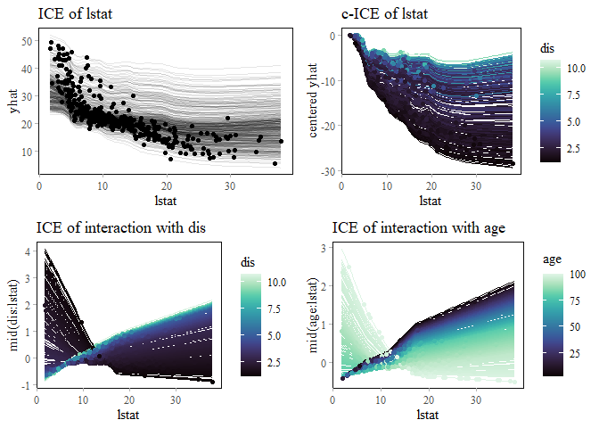

<!-- README.md is generated from README.Rmd. Please edit that file -->

# midr 

<!-- badges: start -->

[](https://github.com/ryo-asashi/midr/actions/workflows/R-CMD-check.yaml)
[](https://CRAN.R-project.org/package=midr)

<!-- badges: end -->

midr is designed to provide a model-agnostic method for interpreting
black-box machine learning models by creating a globally interpretable
surrogate of the target model using a functional decomposition technique
called *Maximum Interpretation Decomposition* (MID). For the theoretical
details of MID, see Iwasawa & Matsumori (2025) \[Forthcoming\], and for
the technical details of the package, see Asashiba et al. (2025)
\[Forthcoming\].

## Installation

You can install the released version of midr from
[CRAN](https://cran.r-project.org/) with:

``` r
install.packages("midr") # not yet available
```

and the development version from [GitHub](https://github.com/) with:

``` r
# install.packages("devtools")
devtools::install_github("ryo-asashi/midr")
```

## Examples

In the following example, we fit a random forest model to the `Boston`
dataset included in ISLR2, and then attempt to interpret it using the
functions of midr.

``` r
# load required packages
library(midr)
library(ggplot2)
library(gridExtra)
library(ISLR2)
library(ranger)
theme_set(theme_midr())
# split the Boston dataset
data("Boston", package = "ISLR2")
set.seed(42)
idx <- sample(nrow(Boston), nrow(Boston) * .75)
train <- Boston[ idx, ]
valid <- Boston[-idx, ]
# fit a random forest model
rf <- ranger(medv ~ ., train, mtry = 5)
preds_rf <- predict(rf, valid)$predictions
cat("RMSE: ", weighted.rmse(valid$medv, preds_rf))
#> RMSE:  3.351362
```

The first step is to create a MID model as a global surrogate of the
target model using `interpret()`.

``` r
# fit a two-dimensional MID model
mid <- interpret(medv ~ .^2, train, rf, lambda = .1)
mid
#> 
#> Call:
#> interpret(formula = yhat ~ .^2, data = train, model = rf, lambda = 0.1)
#> 
#> Intercept: 22.446
#> 
#> Model Class: ranger
#> 
#> Main Effects:
#> 12 main effect terms
#> 
#> Interactions:
#> 66 interaction terms
#> 
#> Uninterpreted Variation Ratio: 0.016249
```

``` r
preds_mid <- predict(mid, valid)
cat("RMSE: ", weighted.rmse(preds_rf, preds_mid))
#> RMSE:  1.106746
```

``` r
cat("RMSE: ", weighted.rmse(valid$medv, preds_mid))
#> RMSE:  3.306111
```

To visualize the main and interaction effects of the variables, apply
`ggmid()` or `plot()` to the fitted MID model.

``` r
# visualize the main effects and interactions of the MID model
grid.arrange(
  ggmid(mid, "lstat") +
    ggtitle("main effect of lstat"),
  ggmid(mid, "dis") +
    ggtitle("main effect of dis"),
  ggmid(mid, "lstat:dis") +
    ggtitle("interaction of lstat:dis"),
  ggmid(mid, "lstat:dis", main.effects = TRUE) +
    ggtitle("interaction + main effects")
)
```



`mid.importance()` helps to compute and compare the importance of main
and interaction effects.

``` r
# visualize the MID importance of the component functions
imp <- mid.importance(mid)
grid.arrange(nrow = 1L,
  ggmid(imp, theme = "Dark 2_r", max.bars = 20L) +
    theme(legend.position = "bottom") +
    ggtitle("importance of variable effects"),
  ggmid(imp, "heatmap") +
    theme(legend.position = "bottom") +
    ggtitle("heatmap of variable importance")
)
```



`mid.breakdown()` provides a way to analyze individual predictions by
decomposing the differences between the intercept and the predicted
value into variable effects.

``` r
# visualize the MID breakdown of the model predictions
bd1 <- mid.breakdown(mid, data = train[1L, ])
bd9 <- mid.breakdown(mid, data = train[9L, ])
grid.arrange(nrow = 1L,
  ggmid(bd1, "waterfall", theme = "Tableau 10", max.bars = 12L) +
    theme(legend.position = "bottom") +
    ggtitle("breakdown of prediction 1"),
  ggmid(bd9, "waterfall", theme = "Tableau 10", max.bars = 12L) +
    theme(legend.position = "bottom") +
    ggtitle("breakdown of prediction 9")
)
```



`mid.conditional()` can be used to compute the ICE curves (Goldstein et
al. 2015) of the fitted MID model, as well as the breakdown of the ICE
curves by main and interaction effects.

``` r
# visualize the ICE curves of the MID model
ice <- mid.conditional(mid, "lstat")
grid.arrange(
  ggmid(ice, alpha = .1) +
    ggtitle("ICE of lstat"),
  ggmid(ice, "centered", alpha = .1, var.color = dis > 3) +
    ggtitle("c-ICE of lstat"),
  ggmid(ice, term = "lstat:dis", var.color = dis > 3, alpha = .1) +
    ggtitle("ICE of interaction with dis"),
  ggmid(ice, term = "lstat:age", var.color = age, dots = FALSE) +
    ggtitle("ICE of interaction with age")
)
```



## References

\[1\] Iwasawa, H. & Matsumori, Y. (2025). “A Functional Decomposition
Approach to Maximize the Interpretability of Black-Box Models”.
\[Forthcoming\]

\[2\] Asashiba, R., Kozuma, R. & Iwasawa, H. (2025). “midr: Learning
from Black-Box Models by Maximum Interpretation Decomposition”.
\[Forthcoming\]

\[3\] Goldstein, A., Kapelner, A., Bleich, J., & Pitkin, E. (2015).
“Peeking Inside the Black Box: Visualizing Statistical Learning With
Plots of Individual Conditional Expectation”. *Journal of Computational
and Graphical Statistics*, *24*(1), 44–65.
<https://doi.org/10.1080/10618600.2014.907095>
