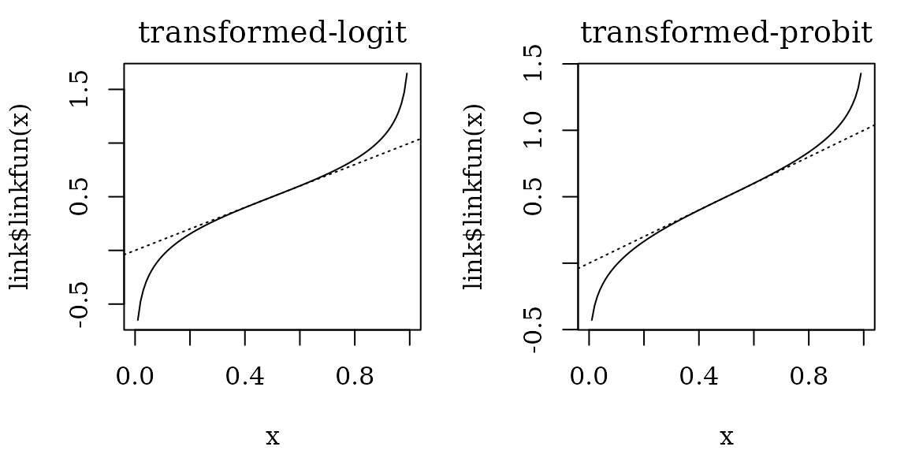
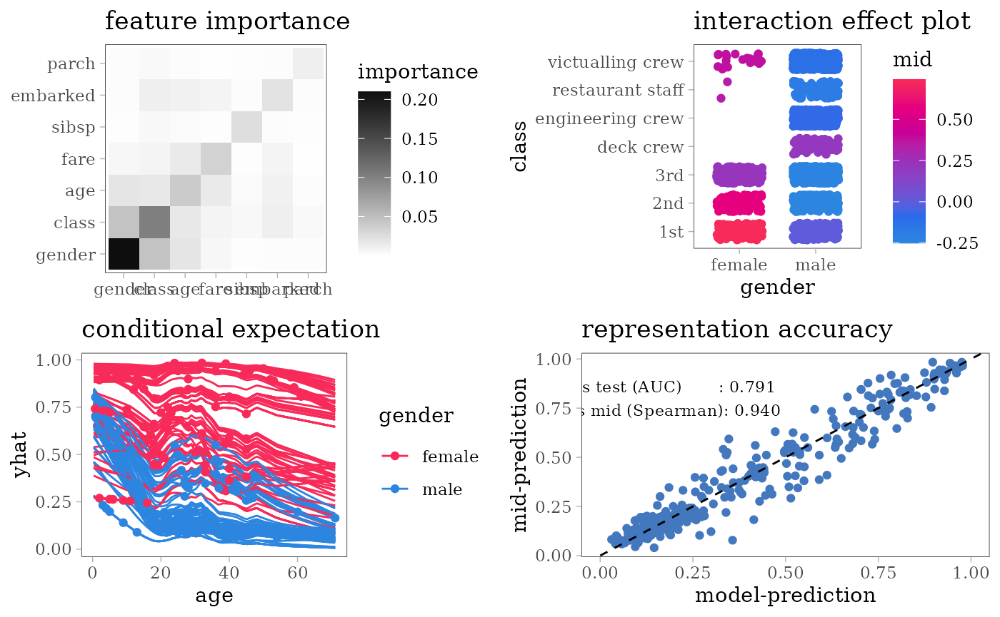
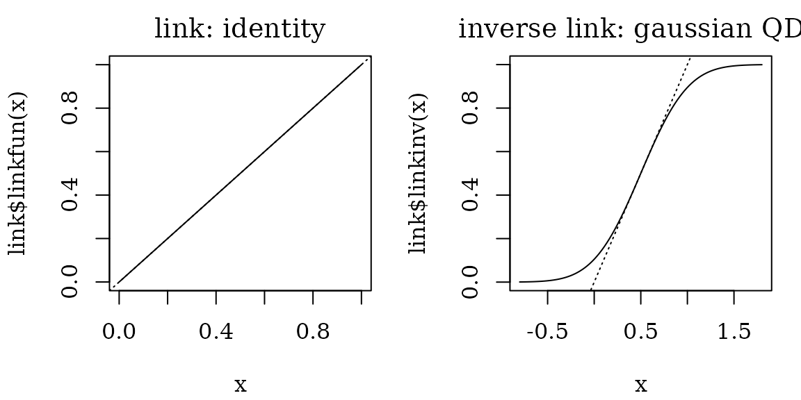
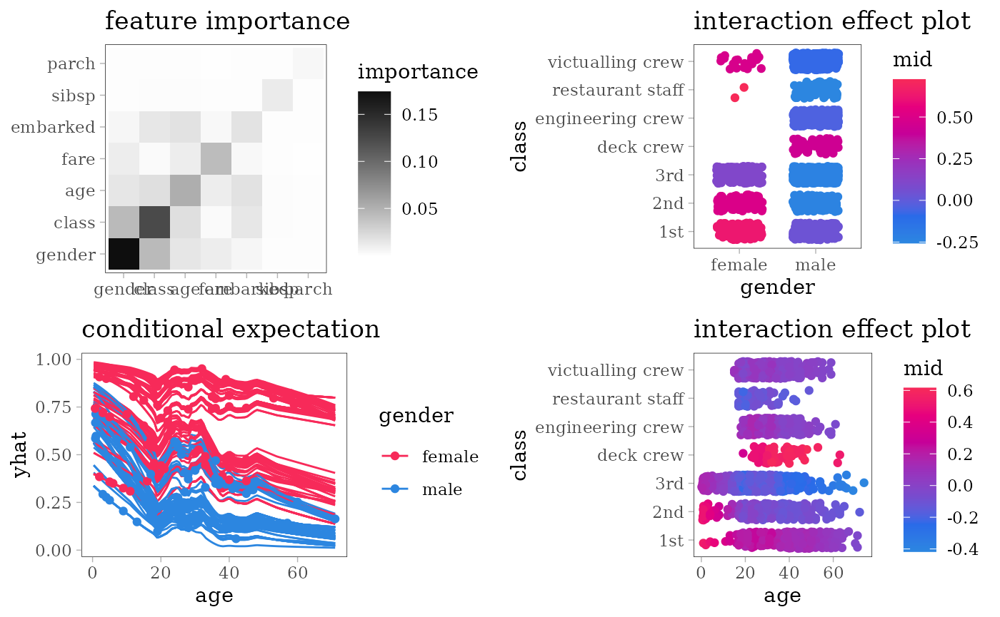

# Interpretation of Classification Models

This article presents some examples of the interpretation of
classification models using `midr`.

``` r
# load required packages
library(midr)
library(ggplot2)
library(gridExtra)
library(Metrics)
theme_set(theme_midr())
```

## Classification Task

We use the titanic dataset, which is available on the website
<https://www.encyclopedia-titanica.org/> and is included in the `DALEX`
package. The dataset has 9 variables for 2207 people, of which 1317 were
passengers and 890 were crew members. We fit some classification models
that predict who survived the tragedy and who did not, and then we
interpret the fitted models.

``` r
# benchmark classification task
library(DALEX)
#> Welcome to DALEX (version: 2.5.3).
#> Find examples and detailed introduction at: http://ema.drwhy.ai/
#> Additional features will be available after installation of: ggpubr.
#> Use 'install_dependencies()' to get all suggested dependencies
set.seed(42)
test_rows <- sample(nrow(titanic), 500L)
train <- titanic[-test_rows, -5]
str(train)
#> 'data.frame':    1707 obs. of  8 variables:
#>  $ gender  : Factor w/ 2 levels "female","male": 2 1 1 2 2 1 2 2 2 2 ...
#>  $ age     : num  42 39 16 25 30 28 27 20 30 27 ...
#>  $ class   : Factor w/ 7 levels "1st","2nd","3rd",..: 3 3 3 3 2 2 3 3 3 3 ...
#>  $ embarked: Factor w/ 4 levels "Belfast","Cherbourg",..: 4 4 4 4 2 2 2 4 4 4 ...
#>  $ fare    : num  7.11 20.05 7.13 7.13 24 ...
#>  $ sibsp   : num  0 1 0 0 1 1 0 0 0 0 ...
#>  $ parch   : num  0 1 0 0 0 0 0 0 0 0 ...
#>  $ survived: Factor w/ 2 levels "no","yes": 1 2 2 2 1 2 2 2 1 1 ...
test  <- titanic[ test_rows, -5]
str(test[, -9])
#> 'data.frame':    500 obs. of  8 variables:
#>  $ gender  : Factor w/ 2 levels "female","male": 2 2 1 2 2 2 2 2 1 2 ...
#>  $ age     : num  74 19 32 21 40 23 24 26 34 28 ...
#>  $ class   : Factor w/ 7 levels "1st","2nd","3rd",..: 3 3 2 3 4 3 5 5 2 5 ...
#>  $ embarked: Factor w/ 4 levels "Belfast","Cherbourg",..: 4 2 4 4 4 4 4 4 4 1 ...
#>  $ fare    : num  7.15 7.04 21 8.08 0 ...
#>  $ sibsp   : num  0 0 0 0 0 0 0 0 1 0 ...
#>  $ parch   : num  0 0 0 0 0 0 0 0 1 0 ...
#>  $ survived: Factor w/ 2 levels "no","yes": 1 1 2 1 1 1 2 1 2 2 ...
```

For each model type, we fit a classification model using the training
dataset of 1707 people and an interpretative MID surrogate of the target
model using the same dataset. We then evaluate the predictive accuracy
of the target model by AUC and the representation accuracy of the
surrogate model by the Spearman’s rank correlation coefficient between
two predicted probabilities.

In the following examples, we use two specialized link functions for
classification tasks: `translogit` (transformed-logit) and `transprobit`
(transformed-probit). These two link functions are transformed so that
$g(0.5) = 0.5$ and $g\prime(0.5) = 1$. With these link functions, the
effects on the linear predictor can be approximately interpreted as the
upper bound of the effects on the predicted probabilities.



``` r
# define utility functions for the following chunks
effect_plots <- function(object) {
  plots <- mid.plots(mid, terms = mid.terms(mid)[1:6])
  for (i in 1:6) {
    plots[[i]] <- plots[[i]] + ggtitle("main effect")
    if (any(i == c(1, 3, 4)))
      plots[[i]] <- plots[[i]] + coord_flip()
  }
  plots
}

interaction_plot <- function(
    object, term = NULL, theme = "shap") {
  if (is.null(term))
    term <- mid.terms(mid.importance(object), main.effect = FALSE)[1L]
  ggmid(object, term, type = "data", data = na.omit(titanic), 
        theme = theme, main.effects = TRUE) +
    theme(legend.position = "right") +
    ggtitle("interaction effect plot")
}

ice_plot <- function(object, variable = "age") {
  ggmid(mid.conditional(object, variable,
                        data = na.omit(titanic)[1:200, ]),
        var.color = gender, theme = "shap_r") +
    theme(legend.position = "right") +
    ggtitle("conditional expectation")
}

importance_plot <- function(object) {
  ggmid(mid.importance(object), "heatmap", theme = "grayscale") +
    theme(legend.position = "right") +
    ggtitle("feature importance")
}

evaluation_plot <- function(model, mid, ...) {
  pred <- get.yhat(model, test, ...)
  pred_mid <- get.yhat(mid, test)
  actual <- as.numeric(test$survived == "yes")
  auc_vs_test <- auc(actual, pred)
  cor_vs_mid <-  cor(pred, pred_mid, method = "spearman",
                     use = "pairwise.complete.obs")
  ggplot() + scale_color_theme("Accent") +
    geom_point(aes(x = pred, y = pred_mid), col = "#4378bf",
               data = na.omit(data.frame(pred, pred_mid))) +
    geom_abline(slope = 1, intercept = 0, col = "black", lty = 2) +
    theme(legend.position = "right") + xlim(0, 1) +
    labs(x = "model-prediction", y = "mid-prediction") +
    annotate("text", family = "serif", size = 3, x = 0.2, y = 0.8,
      label = sprintf("vs test (AUC)       : %.3f\nvs mid (Spearman): %.3f",
                      auc_vs_test, cor_vs_mid)
    ) + ggtitle("representation accuracy")
}
```

## Additive Models

### Logistic Regression

``` r
model <- glm(survived == "yes" ~ ., family = "binomial", data = train)
mid <- interpret(survived ~ .^2, train, model, link = "translogit")
print(mid)
#> 
#> Call:
#> interpret(formula = survived ~ .^2, data = train, model = model,
#>  link = "translogit")
#> 
#> Model Class: glm, lm
#> 
#> Intercept: 0.26975
#> 
#> Main Effects:
#> 7 main effect terms
#> 
#> Interactions:
#> 21 interaction terms
#> 
#> Uninterpreted Variation Ratio: 0
grid.arrange(grobs = effect_plots(mid), nrow = 2L)
```


``` r
grid.arrange(nrow = 2L,
             importance_plot(mid),
             interaction_plot(mid),
             ice_plot(mid),
             evaluation_plot(model, mid, target = "yes"))
#> 'data' and 'weights' are extracted from the 'object'
#> 'data' and 'weights' are extracted from the 'object'
```


## Neural Network

### Single Hidden Layer Network

``` r
library(nnet)
set.seed(42)
model <- nnet(survived ~ ., train, size = 5, maxit = 1e3, trace = FALSE)
mid <- interpret(survived ~ .^2, train, model, link = "transprobit",
                 lambda = .01)
print(mid)
#> 
#> Call:
#> interpret(formula = survived ~ .^2, data = train, model = model,
#>  link = "transprobit", lambda = 0.01)
#> 
#> Model Class: nnet.formula, nnet
#> 
#> Intercept: 0.29558
#> 
#> Main Effects:
#> 7 main effect terms
#> 
#> Interactions:
#> 21 interaction terms
#> 
#> Uninterpreted Variation Ratio: 0.045592
grid.arrange(grobs = effect_plots(mid), nrow = 2L)
```


``` r
grid.arrange(nrow = 2L,
             importance_plot(mid),
             interaction_plot(mid),
             ice_plot(mid),
             evaluation_plot(model, mid))
#> 'data' and 'weights' are extracted from the 'object'
#> 'data' and 'weights' are extracted from the 'object'
```


## Support Vector Machine

### RBF Kernel SVM

``` r
library(e1071)
#> 
#> Attaching package: 'e1071'
#> The following object is masked from 'package:ggplot2':
#> 
#>     element
model <- svm(survived ~ ., train, kernel = "radial", probability = TRUE)
mid <- interpret(survived ~ .^2, train, model, link = "transprobit",
                 pred.args = list(target = "yes"))
print(mid)
#> 
#> Call:
#> interpret(formula = survived ~ .^2, data = train, model = model,
#>  pred.args = list(target = "yes"), link = "transprobit")
#> 
#> Model Class: svm.formula, svm
#> 
#> Intercept: 0.29569
#> 
#> Main Effects:
#> 7 main effect terms
#> 
#> Interactions:
#> 21 interaction terms
#> 
#> Uninterpreted Variation Ratio: 0.0073507
grid.arrange(grobs = effect_plots(mid), nrow = 2L)
```


``` r
grid.arrange(nrow = 2L,
             importance_plot(mid),
             interaction_plot(mid),
             ice_plot(mid),
             evaluation_plot(model, mid, target = "yes"))
#> 'data' and 'weights' are extracted from the 'object'
#> 'data' and 'weights' are extracted from the 'object'
```


## Tree Based Models

### Random Forest

``` r
library(ranger)
set.seed(42)
model <- ranger(survived ~ ., na.omit(train), probability = TRUE)
mid <- interpret(survived ~ .^2, train, model,
                 link = "transprobit", lambda = .01)
print(mid)
#> 
#> Call:
#> interpret(formula = survived ~ .^2, data = train, model = model,
#>  link = "transprobit", lambda = 0.01)
#> 
#> Model Class: ranger
#> 
#> Intercept: 0.30031
#> 
#> Main Effects:
#> 7 main effect terms
#> 
#> Interactions:
#> 21 interaction terms
#> 
#> Uninterpreted Variation Ratio: 0.062185
grid.arrange(grobs = effect_plots(mid), nrow = 2L)
```


``` r
grid.arrange(nrow = 2L,
             importance_plot(mid),
             interaction_plot(mid),
             ice_plot(mid),
             evaluation_plot(model, mid, target = "yes"))
#> 'data' and 'weights' are extracted from the 'object'
#> 'data' and 'weights' are extracted from the 'object'
```



### Decision Tree

``` r
library(rpart)
model <- rpart(survived ~ ., train)
# create encoding frames for CART
frm <- cbind(model$frame, labels(model, collapse = FALSE))
print(t(frm[frm$var != "<leaf>", c("var", "ltemp")]))
#>       1        2       4       9       5        11        3       6        
#> var   "gender" "class" "age"   "sibsp" "age"    "fare"    "class" "fare"   
#> ltemp "b"      "bcefg" ">=9.5" ">=2.5" ">=54.5" ">=26.63" "c"     ">=24.56"
#>       13      
#> var   "age"   
#> ltemp ">=36.5"
fun <- function(x) if (is.numeric(x)) range(x, na.rm = TRUE) else levels(x)
frames <- lapply(train, fun)
frames$age <- c(frames$age, 9.5, 54.5, 36.5)
frames$fare <- c(frames$fare, 26.63, 24.56)
frames$sibsp <- c(frames$fare, 2.5)
mid <- interpret(survived ~ .^2, train, model, link = "transprobit",
                 singular.ok = TRUE, type = 0, frames = frames)
#> singular fit encountered
print(mid)
#> 
#> Call:
#> interpret(formula = survived ~ .^2, data = train, model = model,
#>  link = "transprobit", singular.ok = TRUE, type = 0, frames = frames)
#> 
#> Model Class: rpart
#> 
#> Intercept: 0.29099
#> 
#> Main Effects:
#> 7 main effect terms
#> 
#> Interactions:
#> 21 interaction terms
#> 
#> Uninterpreted Variation Ratio: 0.022918
grid.arrange(grobs = effect_plots(mid), nrow = 2L)
```


``` r
grid.arrange(nrow = 2L,
             importance_plot(mid),
             interaction_plot(mid),
             ice_plot(mid),
             evaluation_plot(model, mid, target = "yes"))
#> 'data' and 'weights' are extracted from the 'object'
#> 'data' and 'weights' are extracted from the 'object'
```


## Other Models

### Predictive MID

To fit a MID model for the Titanic classification task, we can use
“one-sided” link functions: `identity-gaussian` or `identity-logistic`.
These link functions map $0$ to $0$ and $1$ to $1$, while the inverse
link functions map any real number to the value in the unit interval
$(0,1)$.



``` r
mid <- interpret(survived ~ .^2, train,
                 link = "identity-gaussian", lambda = .1)
#> 'model' not passed: response variable in 'data' is used
print(mid)
#> 
#> Call:
#> interpret(formula = survived ~ .^2, data = train, link = "identity-gaussian",
#>  lambda = 0.1)
#> 
#> Intercept: 0.32285
#> 
#> Main Effects:
#> 7 main effect terms
#> 
#> Interactions:
#> 21 interaction terms
#> 
#> Uninterpreted Variation Ratio: 0.61459
grid.arrange(grobs = effect_plots(mid), nrow = 2L)
```


``` r
grid.arrange(nrow = 2L,
             importance_plot(mid),
             interaction_plot(mid),
             ice_plot(mid),
             interaction_plot(mid, "age:class"))
#> 'data' and 'weights' are extracted from the 'object'
#> 'data' and 'weights' are extracted from the 'object'
```


