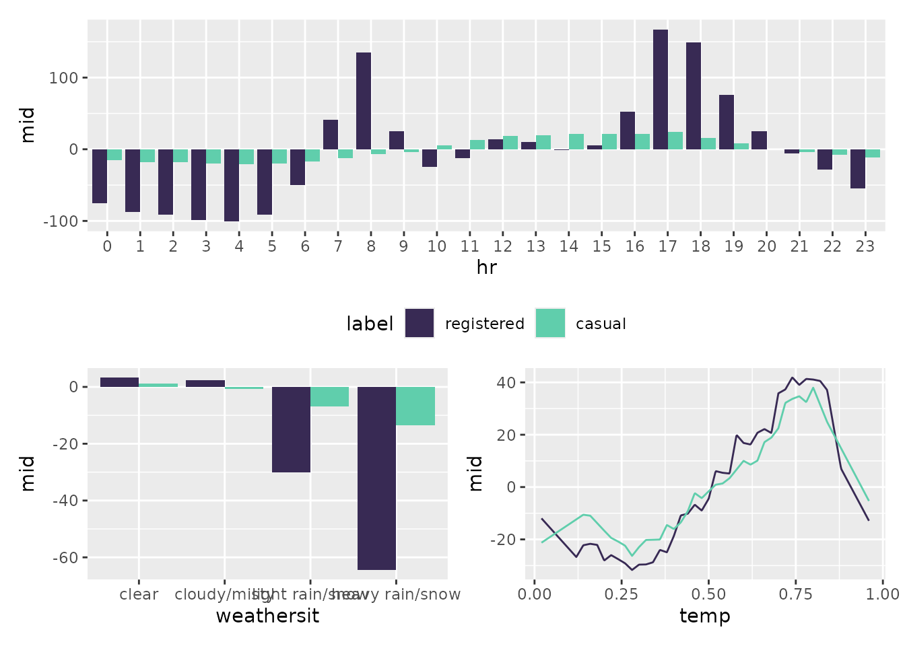
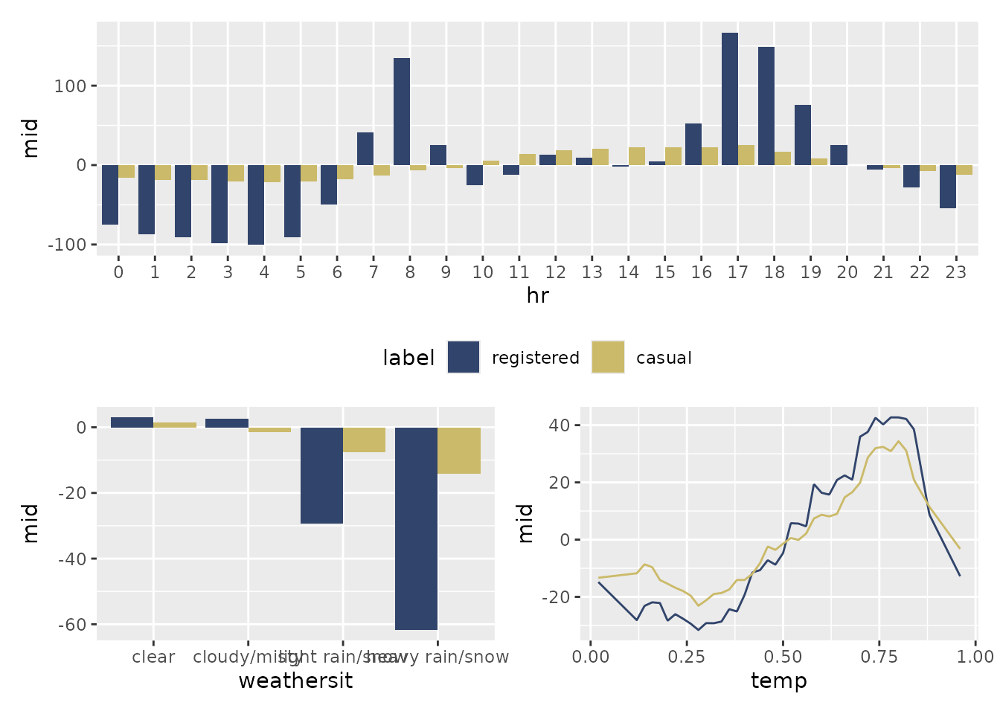

# Getting Started with MID Collections

The **midr** package is designed not only to interpret individual models
but also to facilitate **comparative analysis**. When you are dealing
with multiple outcomes or comparing different modeling approaches,
**midr** provides two specialized collection classes: “midlist” and
“midrib”.

These collections allow you to visualize and compare feature effects,
importance, and instance-level breakdowns across multiple models using a
unified interface.

## 1. The “midlist” Class: Flexible Combination of MID Objects

The “midlist” class is a versatile container used to group existing MID
objects (such as `mid`, `midimp`, `midbrk`, or `midcon`). This is
particularly useful when you have trained separate models—perhaps using
different algorithms or targeting different subsets of data—and want to
compare their behavior side-by-side.

### Example: Comparing Registered vs. Casual Bike Users

In the `Bikeshare` dataset, the factors influencing “registered” users
may differ from those affecting “casual” users. We fit two independent
MID models and unify them into a “midlist” collection.

``` r
library(ggplot2)
library(patchwork)
library(midr)

data(Bikeshare, package = "ISLR2")

# Interpret two separate models independently
mid.registered <- interpret(
  registered ~ mnth + hr + weekday + weathersit + temp + hum,
  data = Bikeshare,
  k = 100,
  lambda = .05
)
mid.casual <- interpret(
  casual ~ mnth + hr + weekday + weathersit + temp + hum,
  data = Bikeshare,
  k = 50
)

# Combine them into a midlist
mids <- midlist(
  registered = mid.registered,
  casual = mid.casual
)
class(mids)
```

    #> [1] "mids"    "midlist"

When [`ggmid()`](https://ryo-asashi.github.io/midr/reference/ggmid.md)
is called on a “midlist” collection, it automatically handles the
comparison.

``` r
options(midr.qualitative = "mako")

p1 <- ggmid(mids, "hr") + theme(legend.position = "bottom")
p2 <- ggmid(mids, "weathersit") + theme(legend.position = "none")
p3 <- ggmid(mids, "temp") + theme(legend.position = "none")

p1 / (p2 + p3)
```



**Mathematical Note:** The “midlist” architecture offers maximum
flexibility. Each model in the collection can maintain its own unique
fitting parameters such as `lambda` (regularization strength), `k`
(number of knots), and `type` (shape of component functions).

## 2. The “midrib” Class: Efficient Multi-Response MID Model

The “midrib” class is designed for **multi-output scenarios**, where a
single model predicts multiple target variables simultaneously. Instead
of interpreting each response in isolation, **midr** treats the
multi-output structure as a single entity—a “midrib” or shared backbone.

You can trigger the creation of a “midrib” object in two ways:

1.  **via formula**: Provide a matrix or data frame as the response
    (e.g., using [`cbind()`](https://rdrr.io/r/base/cbind.html)).
2.  **via prediction function**: Pass a model and a custom `pred.fun`
    that returns a matrix or data frame of predictions.

``` r
# Using a formula with a multi-column response
midrib <- interpret(
  cbind(registered, casual) ~ (mnth + hr + workingday + weathersit + temp + hum),
  data = Bikeshare,
  k = 100,
  lambda = .05
)
```

    #> 'model' not passed: response variable in 'data' is used

``` r
class(midrib)
```

    #> [1] "mids"   "midrib"

The resulting “midrib” object stores the fitted functions (i.e., all
coefficients) for all outcomes in a unified structure, allowing for
seamless comparative plotting.

``` r
options(midr.qualitative = "cividis")

p1 <- ggmid(midrib, "hr") + theme(legend.position = "bottom")
p2 <- ggmid(midrib, "weathersit") + theme(legend.position = "none")
p3 <- ggmid(midrib, "temp") + theme(legend.position = "none")

p1 / (p2 + p3)
```



**Mathematical Note:** By sharing a single design matrix across all
responses, the “midrib” class significantly reduces memory consumption
and computation time. This makes it the ideal choice for
high-dimensional multi-output data.

## Summary of Collection Structures

| Class         | Data Structure                                    | Optimization Logic                                             | Key Advantage                                                 |
|:--------------|:--------------------------------------------------|:---------------------------------------------------------------|:--------------------------------------------------------------|
| **“midlist”** | A list of “mid”, “midimp”, “midbrk”, or “midcon”. | **Independent**: Each model has its own fitting parameters.    | **Flexibility**: Compare heterogeneous models.                |
| **“midrib”**  | A single multivariate response model.             | **Joint**: Shares a single design matrix across all responses. | **Efficiency**: Significant speedup for multivariate targets. |
