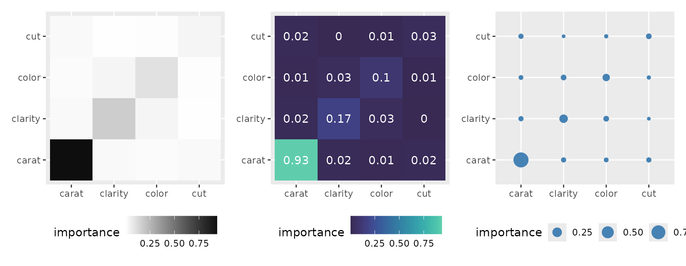

# Visualization with ggplot2 package

``` r
library(midr)
library(ggplot2)
library(patchwork)
theme_set(theme(legend.position = "bottom"))
```

``` r
diamonds_sample <- diamonds
mid <- interpret(
  log(price) ~ (carat + cut + color + clarity) ^ 2,
  data = diamonds_sample
)
```

    #> 'model' not passed: response variable in 'data' is used

``` r
diamonds_sample <- diamonds[sample(nrow(diamonds), 1000L), ]
```

## For Single MID Model

### First-Order Effect

``` r
p1 <- ggmid(mid, term = "carat")
summary(p1)
```

    #> data: carat, carat_min, carat_max, density, mid [25x5]
    #> mapping:  x = ~.data[["carat"]], y = ~.data[["mid"]]
    #> scales:   y, ymin, ymax, yend, yintercept, ymin_final, ymax_final, lower, middle, upper, y0 
    #> faceting:  <empty> 
    #> -----------------------------------
    #> geom_line: na.rm = FALSE, orientation = NA, arrow = NULL, arrow.fill = NULL, lineend = butt, linejoin = round, linemitre = 10
    #> stat_identity: na.rm = FALSE
    #> position_identity

``` r
p2 <- ggmid(mid, term = "carat") +
  geom_point(aes(fill = density), size = 3, shape = 21L) +
  scale_fill_theme("grayscale")
p3 <- ggmid(mid, term = "carat", color = "#00000000") +
  geom_area(fill = "steelblue", alpha = .6)
p1 + p2 + p3
```


``` r
p1 <- ggmid(mid, term = "carat", type = "data")
summary(p1)
```

    #> data: carat, carat_min, carat_max, density, mid [25x5]
    #> mapping:  x = ~.data[["carat"]], y = ~.data[["mid"]]
    #> scales:   y, ymin, ymax, yend, yintercept, ymin_final, ymax_final, lower, middle, upper, y0 
    #> faceting:  <empty> 
    #> -----------------------------------
    #> geom_point: na.rm = FALSE
    #> stat_identity: na.rm = FALSE
    #> position_jitter

``` r
p2 <- ggmid(mid, term = "carat", type = "compound")
summary(p1)
```

    #> data: carat, carat_min, carat_max, density, mid [25x5]
    #> mapping:  x = ~.data[["carat"]], y = ~.data[["mid"]]
    #> scales:   y, ymin, ymax, yend, yintercept, ymin_final, ymax_final, lower, middle, upper, y0 
    #> faceting:  <empty> 
    #> -----------------------------------
    #> geom_point: na.rm = FALSE
    #> stat_identity: na.rm = FALSE
    #> position_jitter

``` r
p3 <- ggmid(mid, term = "carat", type = "data", shape = ".") +
  geom_point(aes(size = density), shape = 1L)
p1 + p2 + p3
```


### First-Order - Factor

``` r
p1 <- ggmid(mid, term = "clarity")
summary(p1)
```

    #> data: clarity, clarity_level, density, mid [8x4]
    #> mapping:  x = ~.data[["clarity"]], y = ~.data[["mid"]]
    #> scales:   y, ymin, ymax, yend, yintercept, ymin_final, ymax_final, lower, middle, upper, y0 
    #> faceting:  <empty> 
    #> -----------------------------------
    #> geom_col: na.rm = FALSE, just = 0.5, lineend = butt, linejoin = mitre
    #> stat_identity: na.rm = FALSE
    #> position_stack

``` r
p2 <- ggmid(mid, term = "clarity", fill = "steelblue") +
  aes(alpha = density)
p3 <- ggmid(mid, term = "clarity", fill = "#00000000") +
  geom_point(aes(size = density))
p1 + p2 + p3
```


``` r
p1 <- ggmid(mid, term = "clarity", type = "data", shape = "|")
summary(p1)
```

    #> data: clarity, clarity_level, density, mid [8x4]
    #> mapping:  x = ~.data[["clarity"]], y = ~.data[["mid"]]
    #> scales:   y, ymin, ymax, yend, yintercept, ymin_final, ymax_final, lower, middle, upper, y0 
    #> faceting:  <empty> 
    #> -----------------------------------
    #> geom_point: na.rm = FALSE
    #> stat_identity: na.rm = FALSE
    #> position_jitter

``` r
p2 <- ggmid(mid, term = "clarity", type = "compound", shape = "|")
summary(p2)
```

    #> data: clarity, clarity_level, density, mid [8x4]
    #> mapping:  x = ~.data[["clarity"]], y = ~.data[["mid"]]
    #> scales:   y, ymin, ymax, yend, yintercept, ymin_final, ymax_final, lower, middle, upper, y0 
    #> faceting:  <empty> 
    #> -----------------------------------
    #> geom_col: na.rm = FALSE, just = 0.5, lineend = butt, linejoin = mitre
    #> stat_identity: na.rm = FALSE
    #> position_stack 
    #> 
    #> geom_point: na.rm = FALSE
    #> stat_identity: na.rm = FALSE
    #> position_jitter

``` r
p3 <- ggmid(mid, term = "clarity", type = "data", shape = ".") +
  geom_point(aes(size = density))
p1 + p2 + p3
```


### Second-Order

``` r
p1 <- ggmid(mid, term = "carat:clarity")
summary(p1)
```

    #> data: carat, carat_min, carat_max, clarity, clarity_level, clarity_min,
    #>   clarity_max, mid [40x8]
    #> mapping:  x = ~.data[["carat"]], y = ~.data[["clarity"]]
    #> scales:   fill 
    #> faceting:  <empty> 
    #> -----------------------------------
    #> mapping: fill = ~.data[["mid"]] 
    #> geom_raster: na.rm = FALSE, interpolate = FALSE, hjust = 0.5, vjust = 0.5
    #> stat_identity: na.rm = FALSE
    #> position_identity

``` r
p2 <- ggmid(mid, term = "carat:clarity", fill = "#00000000") +
  geom_line(aes(group = clarity), color = "gray60") +
  geom_point(aes(fill = mid), shape = 21L, size = 4)
p1 + p2
```


``` r
p1 <- ggmid(mid, term = "carat:clarity", type = "data")
summary(p1)
```

    #> data: carat, carat_min, carat_max, clarity, clarity_level, clarity_min,
    #>   clarity_max, mid [40x8]
    #> mapping:  x = ~.data[["carat"]], y = ~.data[["clarity"]]
    #> scales:   colour 
    #> faceting:  <empty> 
    #> -----------------------------------
    #> mapping: colour = ~.data[["mid"]] 
    #> geom_point: na.rm = FALSE
    #> stat_identity: na.rm = FALSE
    #> position_jitter

``` r
p2 <- ggmid(mid, term = "carat:clarity", type = "compound", shape = 1L)
summary(p2)
```

    #> data: carat, carat_min, carat_max, clarity, clarity_level, clarity_min,
    #>   clarity_max, mid [40x8]
    #> mapping:  x = ~.data[["carat"]], y = ~.data[["clarity"]]
    #> scales:   fill 
    #> faceting:  <empty> 
    #> -----------------------------------
    #> mapping: fill = ~.data[["mid"]] 
    #> geom_raster: na.rm = FALSE, interpolate = FALSE, hjust = 0.5, vjust = 0.5
    #> stat_identity: na.rm = FALSE
    #> position_identity 
    #> 
    #> geom_point: na.rm = FALSE
    #> stat_identity: na.rm = FALSE
    #> position_jitter

``` r
p1 + p2
```


``` r
imp <- mid.importance(mid)
p1 <- ggmid(imp, type = "heatmap")
summary(p1)
```

    #> data: x, y, importance [16x3]
    #> mapping:  x = ~.data[["x"]], y = ~.data[["y"]]
    #> scales:   fill 
    #> faceting:  <empty> 
    #> -----------------------------------
    #> mapping: fill = ~.data[["importance"]] 
    #> geom_tile: na.rm = FALSE, lineend = butt, linejoin = mitre
    #> stat_identity: na.rm = FALSE
    #> position_identity

``` r
p2 <- ggmid(imp, type = "heatmap", theme = "mako") +
  geom_text(aes(label = round(importance, 2)), color = "white")
p3 <- ggmid(imp, type = "heatmap", fill = "#00000000") +
  geom_point(aes(size = importance), color = "steelblue")
p1 + p2 + p3
```



``` r
p1 <- ggmid(imp, type = "boxplot")
summary(p1)
```

    #> data: mid, term [10000x2]
    #> mapping:  x = ~.data[["mid"]], y = ~.data[["term"]]
    #> faceting:  <empty> 
    #> -----------------------------------
    #> geom_boxplot: outliers = TRUE, outlier_gp = list(colour = NULL, fill = NULL, shape = NULL, size = NULL, stroke = 0.5, alpha = NULL), whisker_gp = list(colour = NULL, linetype = NULL, linewidth = NULL), staple_gp = list(colour = NULL, linetype = NULL, linewidth = NULL), median_gp = list(colour = NULL, linetype = NULL, linewidth = NULL), box_gp = list(colour = NULL, linetype = NULL, linewidth = NULL), notch = FALSE, notchwidth = 0.5, staplewidth = 0, varwidth = FALSE, na.rm = FALSE, orientation = NA
    #> stat_boxplot: na.rm = FALSE, orientation = NA
    #> position_dodge2

``` r
p2 <- ggmid(imp, type = "boxplot", color = "#00000000", fill = "#00000000") +
  geom_violin(scale = "width", fill = "steelblue")
p1 + p2
```


``` r
brk <- mid.breakdown(mid)
```

    #> 'data' contains multiple observations: the first observation is used

``` r
p1 <- ggmid(brk)
summary(p1)
```

    #> data: term, mid, order, ymin, ymax, xmin, xmax [10x7]
    #> mapping:  x = ~.data[["xmax"]], y = ~.data[["term"]]
    #> faceting:  <empty> 
    #> -----------------------------------
    #> geom_blank: na.rm = FALSE
    #> stat_identity: na.rm = FALSE
    #> position_identity 
    #> 
    #> mapping: xintercept = ~xintercept 
    #> geom_vline: na.rm = FALSE
    #> stat_identity: na.rm = FALSE
    #> position_identity 
    #> 
    #> mapping: x = NULL, y = NULL, xmin = ~.data[["xmin"]], xmax = ~.data[["xmax"]], ymin = ~.data[["ymin"]], ymax = ~.data[["ymax"]] 
    #> geom_rect: na.rm = FALSE, lineend = butt, linejoin = mitre
    #> stat_identity: na.rm = FALSE
    #> position_identity 
    #> 
    #> mapping: x = ~.data[["xmax"]], y = NULL, ymax = ~.data[["ymax"]], ymin = ~pmax(.data[["ymin"]] - 1, 1 - hw) 
    #> geom_linerange: na.rm = FALSE, orientation = NA, lineend = butt
    #> stat_identity: na.rm = FALSE
    #> position_identity

``` r
p2 <- ggmid(brk, fill = "#00000000", color = "#00000000") +
  geom_linerange(aes(xmax = xmax, xmin = xmin)) +
  geom_point(aes(color = mid), size = 2) +
  scale_color_theme("bicolor")
p1 + p2
```


## For “mids” Objects

``` r
library(survival)
sreg <- coxph(
  Surv(time, status) ~ .,
  data = veteran
)
mids <- interpret(
  Surv(time, status) ~ .,
  data = veteran,
  model = sreg,
  lambda = 1
)
```

## ggmid.mids()

``` r
p1 <- ggmid(mids, "celltype", type = "series", intercept = TRUE)
summary(p1)
```

    #> data: celltype, label, mid [404x3]
    #> mapping:  x = ~.data[["label"]], y = ~.data[["mid"]]
    #> scales:   colour, y, ymin, ymax, yend, yintercept, ymin_final, ymax_final, lower, middle, upper, y0 
    #> faceting:  <empty> 
    #> -----------------------------------
    #> mapping: colour = ~.data[["celltype"]], group = ~.data[["celltype"]] 
    #> geom_line: na.rm = FALSE, orientation = NA, arrow = NULL, arrow.fill = NULL, lineend = butt, linejoin = round, linemitre = 10
    #> stat_identity: na.rm = FALSE
    #> position_identity

``` r
p2 <- ggmid(
  mids, "celltype", type = "series", intercept = TRUE, color = "#00000000"
  ) +
  geom_line(
    aes(x = as.numeric(label), y = intercept),
    data.frame(label = labels(mids), intercept = mids$intercept),
    linewidth = 2, alpha = .1
  ) +
  geom_line(aes(linetype = celltype))
p1 + p2
```


