# Visualization with ggplot2 package

## Introduction

This tutorial explains how to flexibly visualize MID models built with
the **midr** package using the **ggplot2** ecosystem.

Since the
[`ggmid()`](https://ryo-asashi.github.io/midr/reference/ggmid.md)
function returns a ggplot object, you can easily combine plots using
**patchwork** or add advanced customizations via `geom_*()` functions.
Through this article, we will explore step-by-step how to create rich
figures suitable for papers and reports, starting from the default
plots.

``` r
library(midr)
library(ggplot2)
library(patchwork)
library(survival)
theme_set(theme(legend.position = "bottom"))
.transparent <- "#ffffff00"
```

## Single MID Model

First, let’s look at basic visualizations using a single MID model.
Here, we use the built-in `diamonds` dataset to build a model that
predicts the diamond’s price.

``` r
# fit a MID model
mid <- interpret(
  log(price) ~ (carat + cut + color + clarity) ^ 2,
  k = 5L, # number of basis functions
  lump = "auto", # lump factor levels
  data = diamonds,
  verbosity = 0L
)
diamonds_sample <- diamonds[sample(nrow(diamonds), 1000L), ]
mid$call$data <- quote(diamonds_sample)
```

### First-Order Effect (Numeric Variable)

To examine the effect of a continuous variable, specify the variable
name in the `term` argument.

``` r
p1 <- ggmid(mid, term = "carat")
p1
```

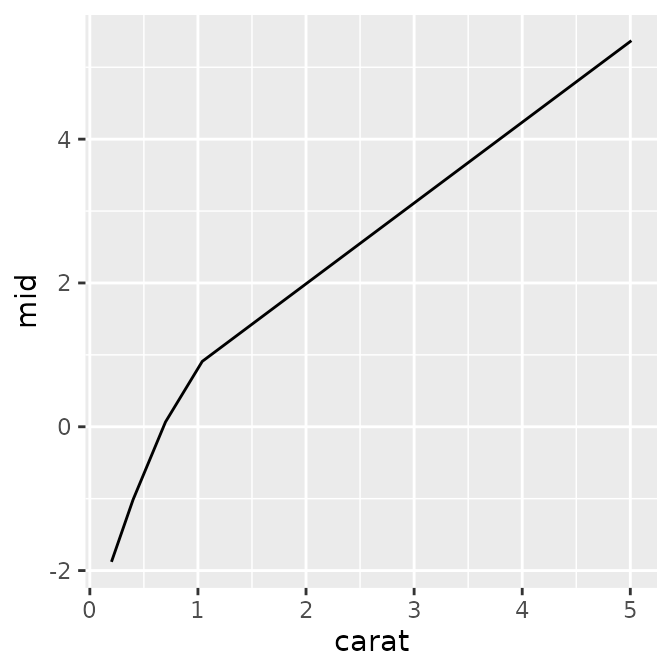

In addition to the default plot, you can also see the underlying data
and aesthetic mappings (`aes`) that
[`ggmid()`](https://ryo-asashi.github.io/midr/reference/ggmid.md)
generates internally.

    #> $data
    #>   carat carat_min carat_max    density         mid
    #> 1   0.2      0.20      0.30 0.09865591 -1.87881109
    #> 2   0.4      0.30      0.55 0.29628476 -1.01371077
    #> 3   0.7      0.55      0.87 0.21428417  0.06705239
    #> 
    #> $mapping
    #> Aesthetic mapping: 
    #> * `x` -> `.data[["carat"]]`
    #> * `y` -> `.data[["mid"]]`

By combining standard ggplot2 functions, you have a high degree of
freedom to customize the plot—such as changing line widths and colors,
or overlaying actual data points with
[`geom_point()`](https://ggplot2.tidyverse.org/reference/geom_point.html).

``` r
p1 <- ggmid(mid, term = "carat", linewidth = 2, color = "dodgerblue4")
p2 <- ggmid(mid, term = "carat", color = .transparent) +
  geom_point(aes(y = log(price) - mean(log(price))), data = diamonds_sample) +
  geom_line(color = "firebrick1")
p3 <- ggmid(mid, term = "carat", type = "data", theme = "shap") +
  geom_line(linewidth = 4, alpha = .2)
p1 + p2 + p3
```

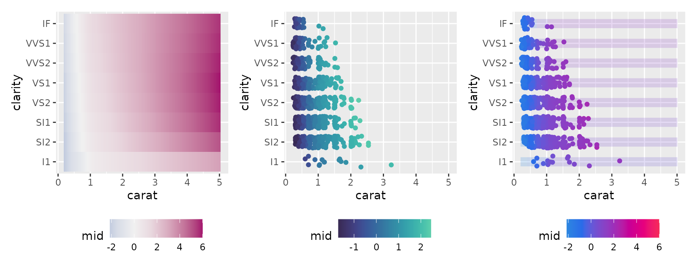

### First-Order Effect (Factor Variable)

Categorical variables can be visualized in a similar manner. If the
`lump` argument was specified during model fitting, factor levels are
automatically grouped together. However, by setting `lumped = FALSE`
when plotting, you can expand and display all levels.

``` r
p1 <- ggmid(mid, term = "clarity")
p2 <- ggmid(mid, term = "clarity", lumped = FALSE)
p1 + p2
```

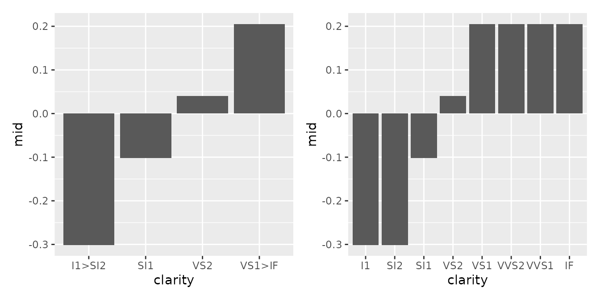

    #> $data
    #>   clarity clarity_level   density         mid
    #> 1  I1>SI2             1 0.1841861 -0.30105990
    #> 2     SI1             2 0.2422136 -0.10227555
    #> 3     VS2             3 0.2272525  0.04047436
    #> 
    #> $mapping
    #> Aesthetic mapping: 
    #> * `x` -> `.data[["clarity"]]`
    #> * `y` -> `.data[["mid"]]`

You can also overlay bar charts or use
[`geom_jitter()`](https://ggplot2.tidyverse.org/reference/geom_jitter.html)
to simultaneously represent the data distribution for each category.

``` r
p1 <- ggmid(mid, term = "clarity", fill = "dodgerblue4", lumped = FALSE)
p2 <- ggmid(mid, term = "clarity", fill = .transparent, lumped = FALSE) +
  geom_jitter(aes(y = log(price) - mean(log(price))), height = 0, data = diamonds_sample) +
  geom_col(fill = NA, color = "firebrick1")
p3 <- ggmid(mid, term = "clarity", type = "data", theme = "shap", shape = "|") +
  geom_line(aes(group = NA), linewidth = 4, alpha = .2)
p1 + p2 + p3
```

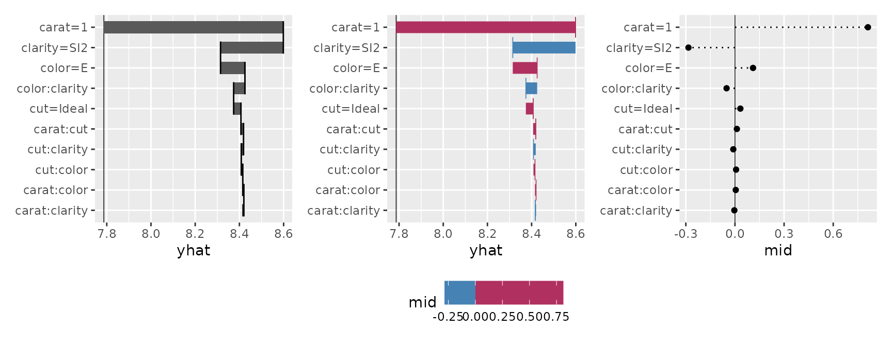

### Second-Order Effect

This visualizes the interaction between two variables
(`term = "var1:var2"`). By specifying `main.effects = TRUE`, you can
view the overall effect, including the main effects.

``` r
p1 <- ggmid(mid, term = "carat:clarity")
p2 <- ggmid(mid, term = "carat:clarity", main.effects = TRUE)
p1 + p2
```

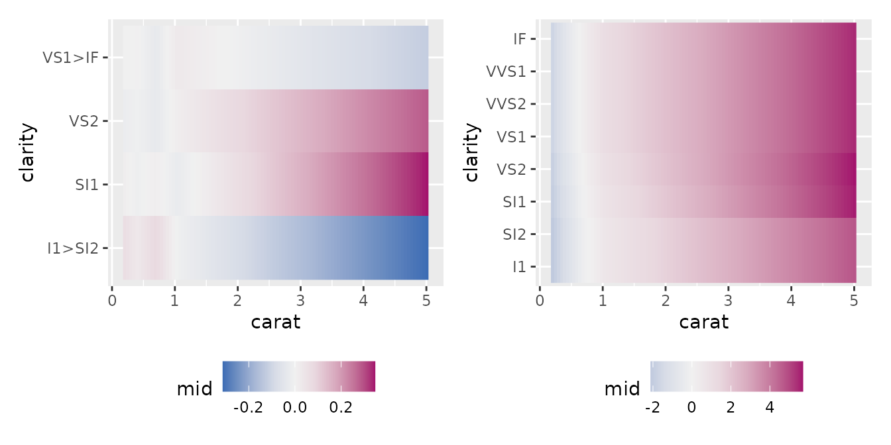

    #> $data
    #>   carat carat_min carat_max clarity clarity_level clarity_min clarity_max
    #> 1   0.2      0.20      0.30  I1>SI2             1         0.5         1.5
    #> 2   0.4      0.30      0.55  I1>SI2             1         0.5         1.5
    #> 3   0.7      0.55      0.87  I1>SI2             1         0.5         1.5
    #>          mid
    #> 1 0.06350548
    #> 2 0.03083300
    #> 3 0.08065825
    #> 
    #> $mapping
    #> Aesthetic mapping: 
    #> * `x` -> `.data[["carat"]]`
    #> * `y` -> `.data[["clarity"]]`

Additionally, by utilizing heatmap-oriented themes (e.g.,
`theme = "Heat"`, `"mako"`), complex second-order effects can be
represented intuitively.

``` r
p1 <- ggmid(mid, term = "carat:clarity", type = "compound",
            theme = "Heat", size = 1, shape = 1, lumped = FALSE)
p2 <- ggmid(mid, term = "carat:clarity", type = "data",
            theme = "mako", main.effects = TRUE)
p3 <- ggmid(mid, term = "carat:clarity", type = "data",
            theme = "shap", main.effects = TRUE) +
  geom_line(aes(group = clarity, color = mid), linewidth = 4, alpha = .2)
p1 + p2 + p3
```

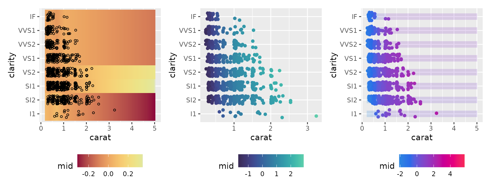

### Feature Importance

Here, we visualize the importance of each variable calculated by the
[`mid.importance()`](https://ryo-asashi.github.io/midr/reference/mid.importance.md)
function.
[`ggmid()`](https://ryo-asashi.github.io/midr/reference/ggmid.md)
supports various plot formats depending on your needs through the type
argument.

``` r
imp <- mid.importance(mid)
p1 <- ggmid(imp)
p2 <- ggmid(imp, type = "dotchart")
p1 + p2
```

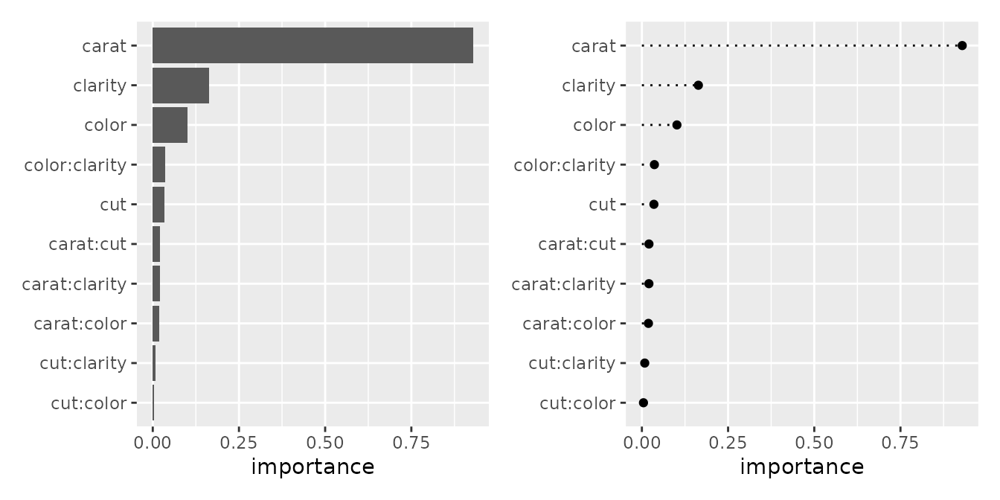

    #> $data
    #>      term importance order
    #> 1   carat  0.9291310     1
    #> 2 clarity  0.1638387     1
    #> 3   color  0.1016388     1
    #> 
    #> $mapping
    #> Aesthetic mapping: 
    #> * `x` -> `.data[["importance"]]`
    #> * `y` -> `.data[["term"]]`

``` r
p1 <- ggmid(imp, theme = "light")
p2 <- ggmid(imp, type = "dotchart", theme = "shap", size = 3)
p3 <- ggmid(imp, type = "dotchart", color = .transparent) +
  geom_label(aes(x = importance, label = round(importance, 2)), size = 3) +
  lims(x = c(-0.05, 1.05))
p1 + p2 + p3
```

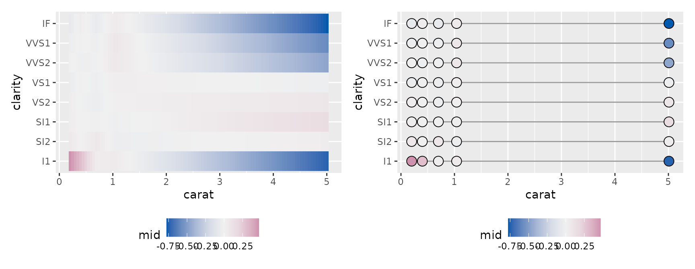

The heatmap style provides a high-level overview of importance values in
a heatmap format.

``` r
p1 <- ggmid(imp, type = "heatmap")
p1
```

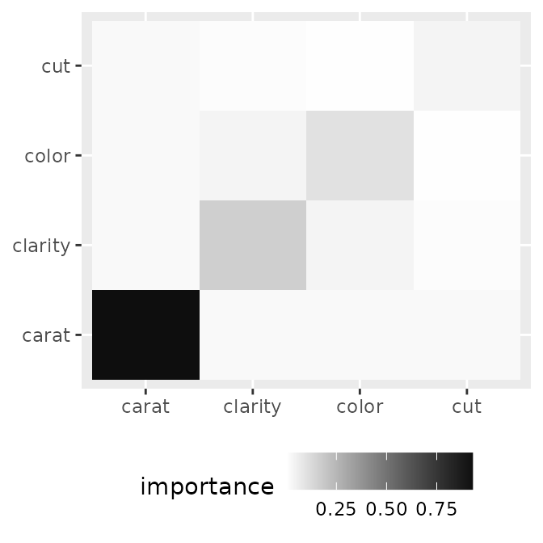

    #> $data
    #>         x       y importance
    #> 1   carat   carat  0.9291310
    #> 2 clarity clarity  0.1638387
    #> 3   color   color  0.1016388
    #> 
    #> $mapping
    #> Aesthetic mapping: 
    #> * `x` -> `.data[["x"]]`
    #> * `y` -> `.data[["y"]]`

Adding text
([`geom_text()`](https://ggplot2.tidyverse.org/reference/geom_text.html))
to explicitly show the values makes it even more reader-friendly.

``` r
p1 <- ggmid(imp, type = "heatmap", fill = "white", color = "black") + 
  geom_text(aes(label = round(importance, 2)))
p2 <- ggmid(imp, type = "heatmap", theme = "mako_r") +
  geom_text(aes(label = round(importance, 2)), color = "white")
p3 <- ggmid(imp, type = "heatmap", fill = .transparent) +
  geom_point(aes(size = importance), color = "steelblue")
p1 + p2 + p3
```

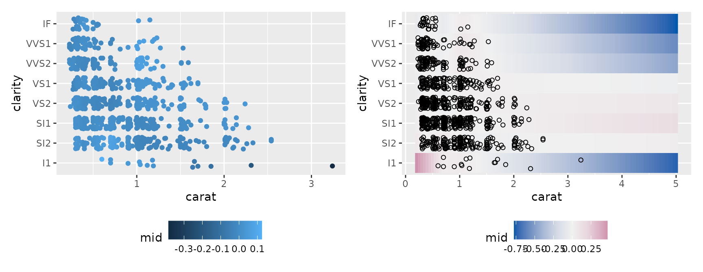

The boxplot style represents the distribution of importance in detail.

``` r
p1 <- ggmid(imp, type = "boxplot")
p1
```

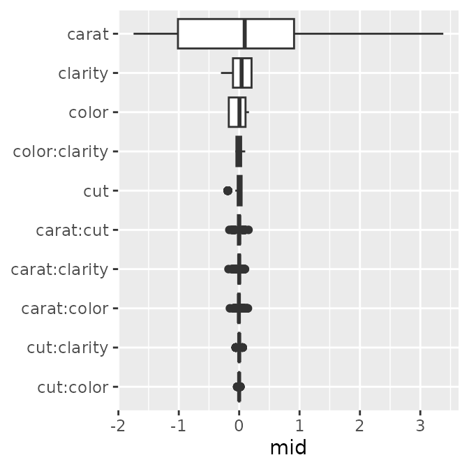

    #> $data
    #>          mid  term importance order
    #> 1  0.8101023 carat   0.929131     1
    #> 2 -1.4030059 carat   0.929131     1
    #> 3  0.8844073 carat   0.929131     1
    #> 
    #> $mapping
    #> Aesthetic mapping: 
    #> * `x` -> `.data[["mid"]]`
    #> * `y` -> `.data[["term"]]`

``` r
p1 <- ggmid(imp, type = "boxplot", theme = "mako")
p2 <- ggmid(imp, type = "boxplot", fill = .transparent, color = .transparent) +
  geom_jitter(size = .5, width = 0) +
  geom_boxplot(color = "firebrick1", fill = NA)
p3 <- ggmid(imp, type = "boxplot", fill = .transparent, color = .transparent) +
  geom_violin(aes(fill = importance), scale = "width")
p1 + p2 + p3
```

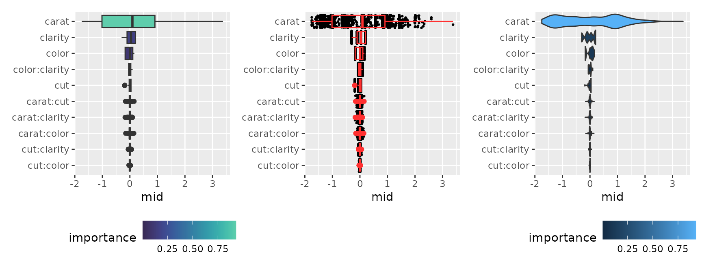

### Prediction Breakdown

Using
[`mid.breakdown()`](https://ryo-asashi.github.io/midr/reference/mid.breakdown.md),
we decompose and display the contribution of each feature to the
prediction for a specific observation.

``` r
brk <- mid.breakdown(mid, row = 1L)
p1 <- ggmid(brk)
p1
```

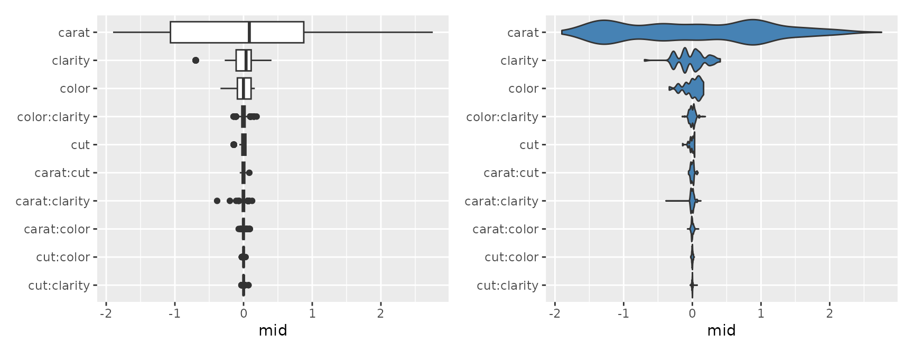

    #> $data
    #>          term        mid order ymin ymax     xmin     xmax
    #> 1     carat=1  0.8101023     1  9.7 10.3 7.786768 8.596871
    #> 2 clarity=SI2 -0.3010599     1  8.7  9.3 8.596871 8.295811
    #> 3     color=E  0.1052924     1  7.7  8.3 8.295811 8.401103
    #> 
    #> $mapping
    #> Aesthetic mapping: 
    #> * `x` -> `.data[["xmax"]]`
    #> * `y` -> `.data[["term"]]`

``` r
p1 <- ggmid(brk, theme = "shap@qual", color = .transparent, width = .95) +
  geom_text(aes(label = round(mid, 2), x = (xmin + xmax) / 2), size = 3)
p2 <- ggmid(brk, pattern = c("%t", "%t, %t"), width = .05)
p3 <- ggmid(brk, pattern = c("%t\n%v", "%t:%t\n%v:%v"), max.nterms = 7)
p1 + p2 + p3
```

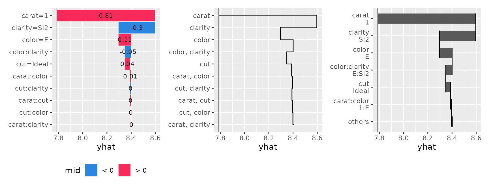

You can flexibly adjust the layout using the pattern and type arguments,
ranging from waterfall-like charts to bar plots and dot charts.

``` r
p1 <- ggmid(brk, type = "barplot")
p2 <- ggmid(brk, type = "dotchart")
p1 + p2
```

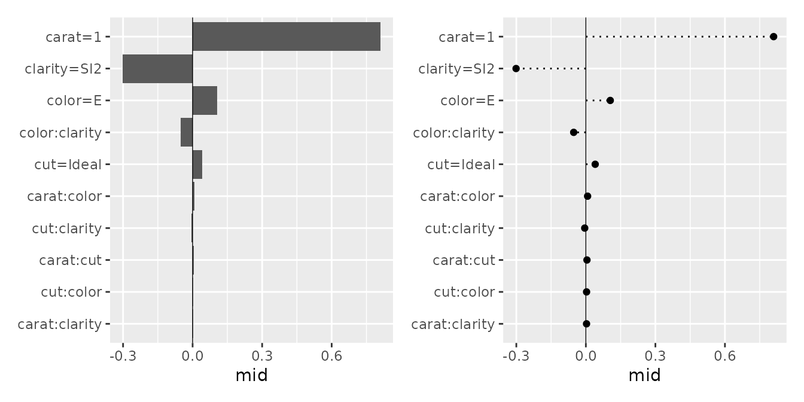

    #> $data
    #>          term        mid order
    #> 1     carat=1  0.8101023     1
    #> 2 clarity=SI2 -0.3010599     1
    #> 3     color=E  0.1052924     1
    #> 
    #> $mapping
    #> Aesthetic mapping: 
    #> * `x` -> `.data[["mid"]]`
    #> * `y` -> `.data[["term"]]`

``` r
p1 <- ggmid(brk, type = "barplot", theme = "light")
p2 <- ggmid(brk, type = "barplot", theme = "bicolor_r", vline = FALSE) +
  aes(x = abs(mid)) +
  geom_text(aes(label = round(mid, 2), x = abs(mid) + 0.03), size = 3)
p3 <- ggmid(brk, type = "dotchart", theme = "shap", size = 3)
p1 + p2 + p3
```

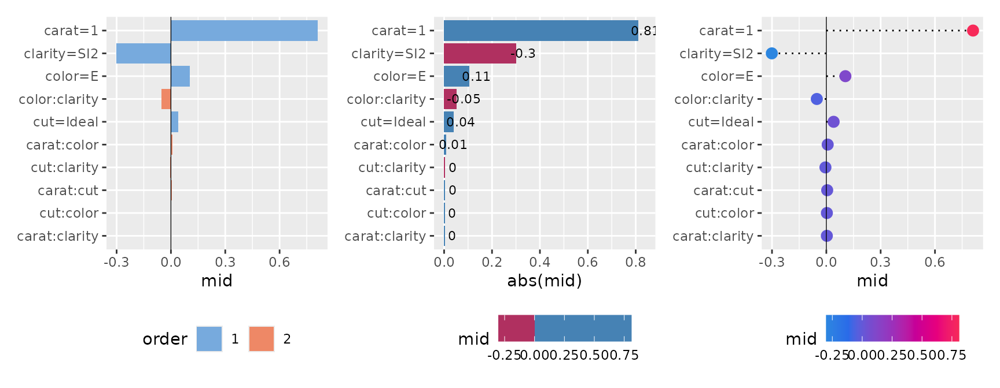

### Conditional Expectation

Using
[`mid.conditional()`](https://ryo-asashi.github.io/midr/reference/mid.conditional.md),
we can observe how the predicted values transition as a specific
variable changes (similar to ICE plots or PDPs). By specifying
`type = "centered"`, you can align the baselines by showing the amount
of change from a specific reference point (reference), making it easier
to compare the model’s behavior across different groups.

``` r
con <- mid.conditional(mid, variable = "carat", data = diamonds_sample[1:100, ])
p1 <- ggmid(con)
p2 <- ggmid(con, type = "centered")
p1 + p2
```

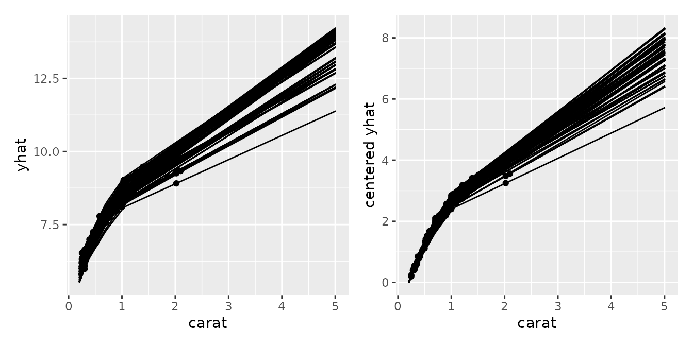

    #> $data
    #>   .id     yhat log.price. carat     cut color clarity centered yhat
    #> 1   1 8.402259   8.468003  1.00   Ideal     E     SI2     2.6519350
    #> 2   2 6.624097   6.598509  0.31   Ideal     D     VS2     0.4666793
    #> 3   3 9.007005   8.964056  1.03 Premium     E     VS1     2.6788562
    #> 
    #> $mapping
    #> Aesthetic mapping: 
    #> * `x` -> `.data[["carat"]]`
    #> * `y` -> `.data[["centered yhat"]]`

``` r
p1 <- ggmid(con, points = FALSE, color = "dodgerblue4") +
  geom_point()
p2 <- ggmid(con, type = "centered", var.color = cut,
            shape = 1, size = 3, var.linetype = cut)
p3 <- ggmid(con, type = "centered", theme = "light",
            var.color = "cut", reference = 50)
p1 + p2 + p3
```

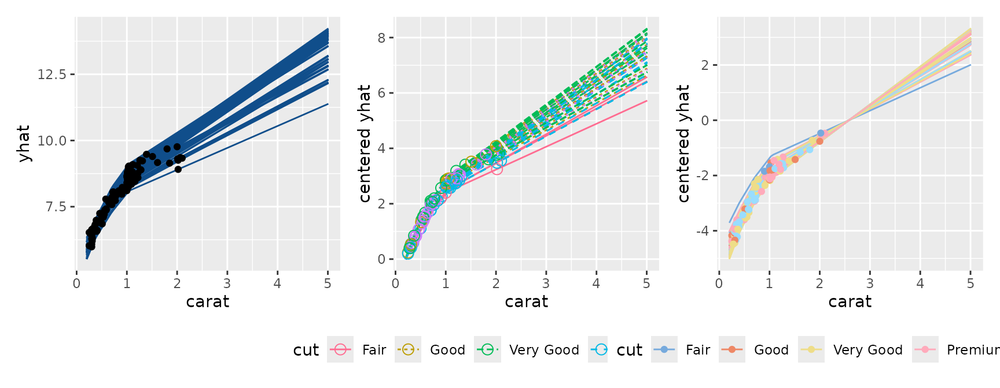

## Collection of MID Models

Next, we will explore visualizations for a collection (set) of multiple
MID models. As an example, we build a Cox proportional hazards model
using the `veteran` dataset from the **survival** package, and evaluate
the transition of effects over time as a collection of models.

``` r
# fit a survival mid model
sreg <- coxph(
  Surv(time, status) ~ .,
  data = veteran
)
mids <- interpret(
  Surv(time, status) ~ .,
  data = veteran,
  model = sreg,
  lambda = 1
)
```

### First-Order Effect (Numeric Variable)

``` r
p1 <- ggmid(mids, term = "karno")
p1
```

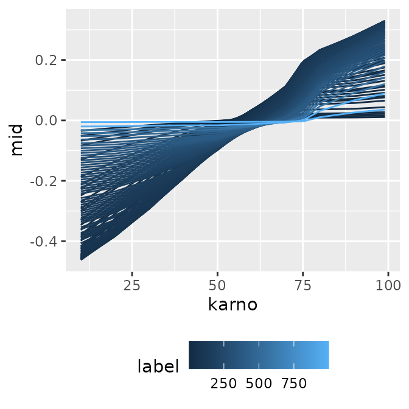

    #> $data
    #>      karno label         mid
    #> 1 10.00000     1 -0.03451831
    #> 2 10.90816     1 -0.03361561
    #> 3 11.81633     1 -0.03271292
    #> 
    #> $mapping
    #> Aesthetic mapping: 
    #> * `x` -> `.data[["karno"]]`
    #> * `y` -> `.data[["mid"]]`

When you have multiple models with numeric labels, specifying
`type = "series"` allows you to easily create a time-series-like
transition graph with the model index (here, survival time) on the
x-axis.

``` r
p1 <- ggmid(mids, term = "karno", type = "series")
p1
```

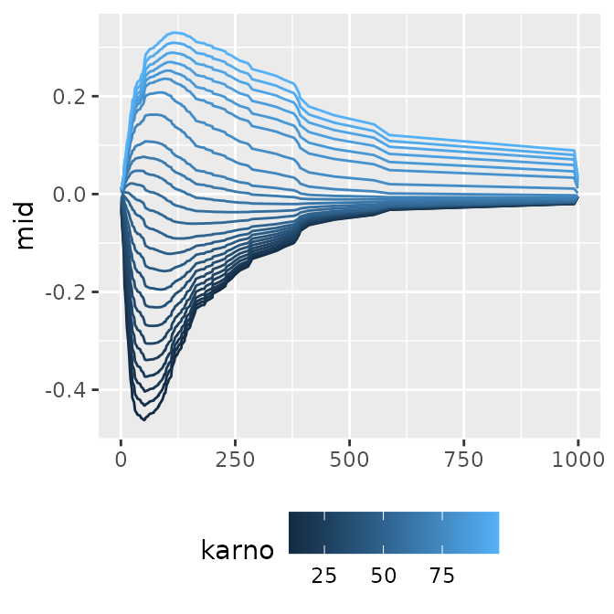

    #> $data
    #>      karno label         mid
    #> 1 10.00000     1 -0.03451831
    #> 2 13.70833     1 -0.03083229
    #> 3 17.41667     1 -0.02714627
    #> 
    #> $mapping
    #> Aesthetic mapping: 
    #> * `x` -> `.data[["label"]]`
    #> * `y` -> `.data[["mid"]]`

You can also plot the baseline intercept transition by setting
`intercept = TRUE`, or adjust the format for publication using theme
functions, such as monochrome (`theme = "grayscale"`).

``` r
p1 <- ggmid(mids, term = "karno", intercept = TRUE)
p2 <- ggmid(mids, term = "karno", type = "series", intercept = TRUE,
            theme = "mako")
p3 <- ggmid(mids, term = "karno", type = "series", intercept = TRUE,
            theme = "grayscale") +
  geom_line(
    data = data.frame(
      mid = mids$intercept,
      label = as.numeric(labels(mids))
    ),
    color = "firebrick1"
  )
p1 + p2 + p3
```

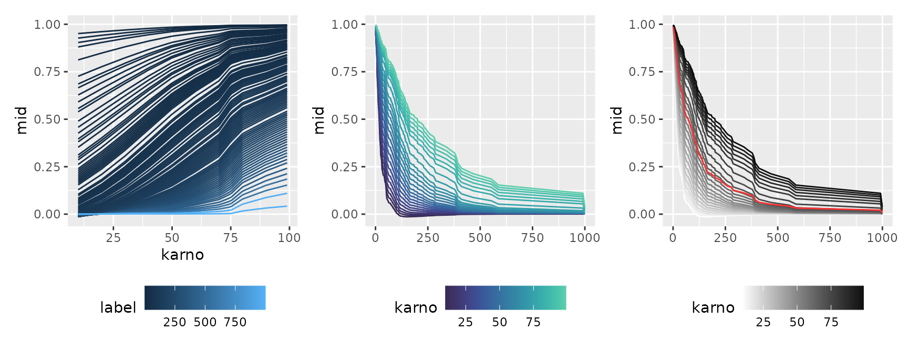

### First-Order Effect (Factor Variable)

``` r
p1 <- ggmid(mids, "celltype")
p1
```

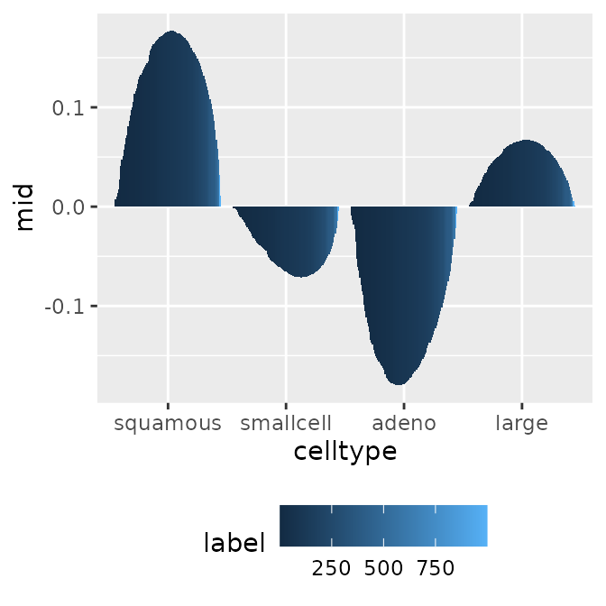

    #> $data
    #>    celltype label          mid
    #> 1  squamous     1  0.007073419
    #> 2 smallcell     1 -0.001229267
    #> 3     adeno     1 -0.009254885
    #> 
    #> $mapping
    #> Aesthetic mapping: 
    #> * `x` -> `.data[["celltype"]]`
    #> * `y` -> `.data[["mid"]]`

``` r
p1 <- ggmid(mids, "celltype", type = "series")
p1
```

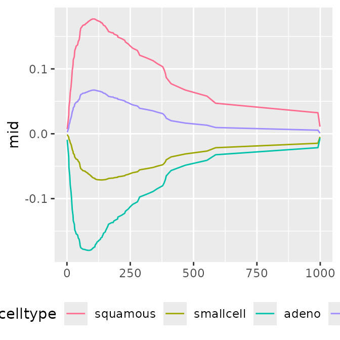

    #> $data
    #>    celltype label          mid
    #> 1  squamous     1  0.007073419
    #> 2 smallcell     1 -0.001229267
    #> 3     adeno     1 -0.009254885
    #> 
    #> $mapping
    #> Aesthetic mapping: 
    #> * `x` -> `.data[["label"]]`
    #> * `y` -> `.data[["mid"]]`

``` r
p1 <- ggmid(mids, term = "celltype", intercept = TRUE)
p2 <- ggmid(mids, term = "celltype", type = "series", intercept = TRUE,
            theme = "mako")
p3 <- ggmid(mids, term = "celltype", type = "series", intercept = TRUE) +
  geom_line(
    data = data.frame(
      mid = mids$intercept,
      label = as.numeric(labels(mids))
    ),
    linetype = "dotted"
  )
p1 + p2 + p3
```

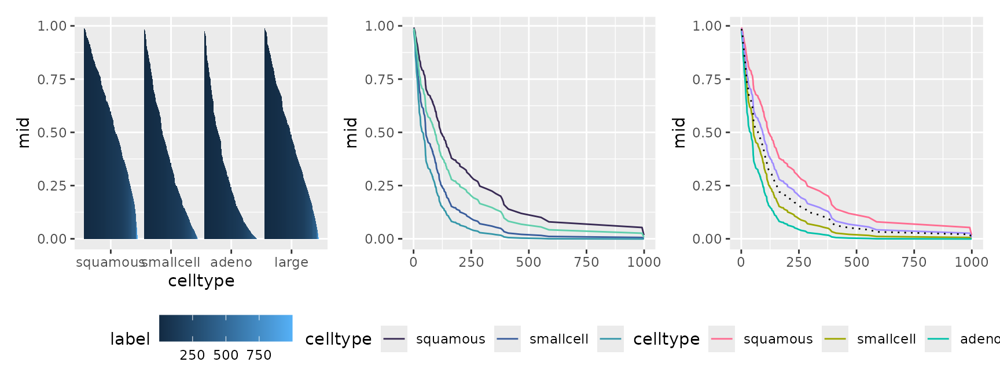

### Feature Importance

The feature importance for the model collection can also be visualized
along the progression of time (or model differences).

``` r
imps <- mid.importance(mids)
p1 <- ggmid(imps)
p1
```

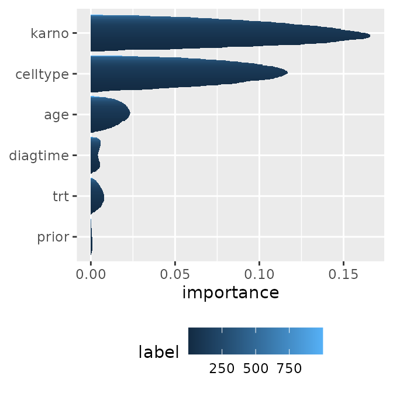

    #> $data
    #>   term label  importance
    #> 1  age     1 0.001147048
    #> 2  age    10 0.007087329
    #> 3  age   100 0.023270137
    #> 
    #> $mapping
    #> Aesthetic mapping: 
    #> * `x` -> `.data[["importance"]]`
    #> * `y` -> `.data[["term"]]`

``` r
p1 <- ggmid(imps, type = "series")
p1
```

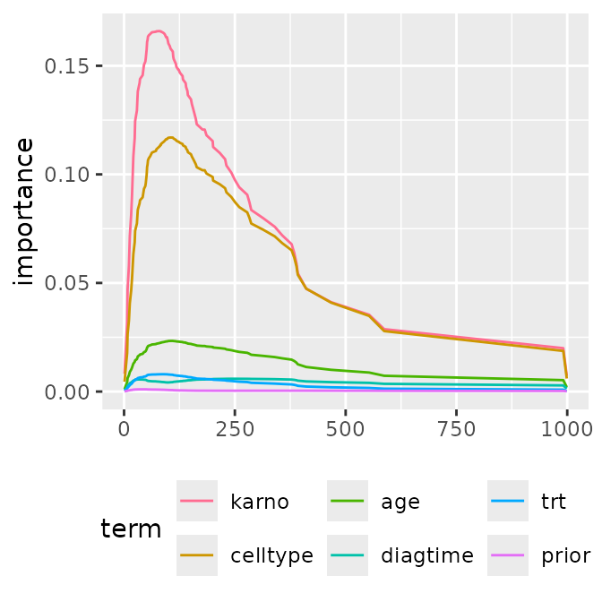

    #> $data
    #>   term label  importance
    #> 1  age     1 0.001147048
    #> 2  age    10 0.007087329
    #> 3  age   100 0.023270137
    #> 
    #> $mapping
    #> Aesthetic mapping: 
    #> * `x` -> `.data[["label"]]`
    #> * `y` -> `.data[["importance"]]`

By using stacked area charts with
[`geom_area()`](https://ggplot2.tidyverse.org/reference/geom_ribbon.html)
or representing distributions with
[`geom_boxplot()`](https://ggplot2.tidyverse.org/reference/geom_boxplot.html)
or
[`geom_jitter()`](https://ggplot2.tidyverse.org/reference/geom_jitter.html),
you can visually capture the dynamics of which features become important
at what specific timing.

``` r
p1 <- ggmid(imps, fill = .transparent) +
  geom_boxplot()
p2 <- ggmid(imps, fill = .transparent) +
  geom_jitter(aes(color = label), width = 0) +
  scale_color_theme("mako")
p3 <- ggmid(imps, type = "series", color = .transparent) +
  geom_area(aes(fill = term), position = "fill") +
  scale_fill_theme("light")

p1 + p2 + p3
```

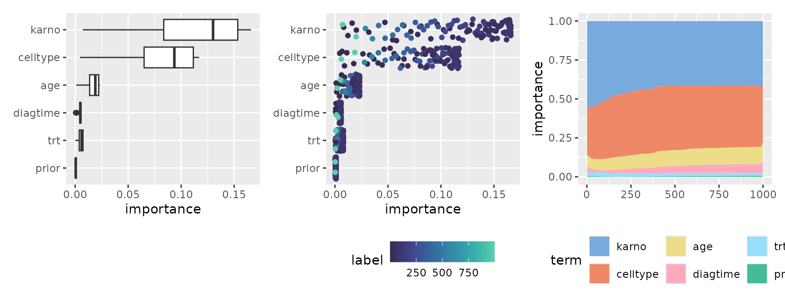

### Prediction Breakdown

Similar to a single breakdown, this visualizes how the contribution of
features for a specific observation changes across the entire
collection. It is highly effective for tracking how the local impact of
each variable fluctuates over time.

``` r
brks <- mid.breakdown(mids, row = 42)
p1 <- ggmid(brks)
p1
```

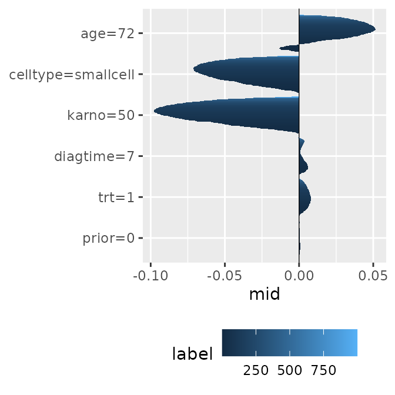

    #> $data
    #>     term label          mid
    #> 1 age=72     1 -0.002957693
    #> 2 age=72    10 -0.012751333
    #> 3 age=72   100  0.048345388
    #> 
    #> $mapping
    #> Aesthetic mapping: 
    #> * `x` -> `.data[["mid"]]`
    #> * `y` -> `.data[["term"]]`

``` r
p1 <- ggmid(brks, type = "series")
p1
```

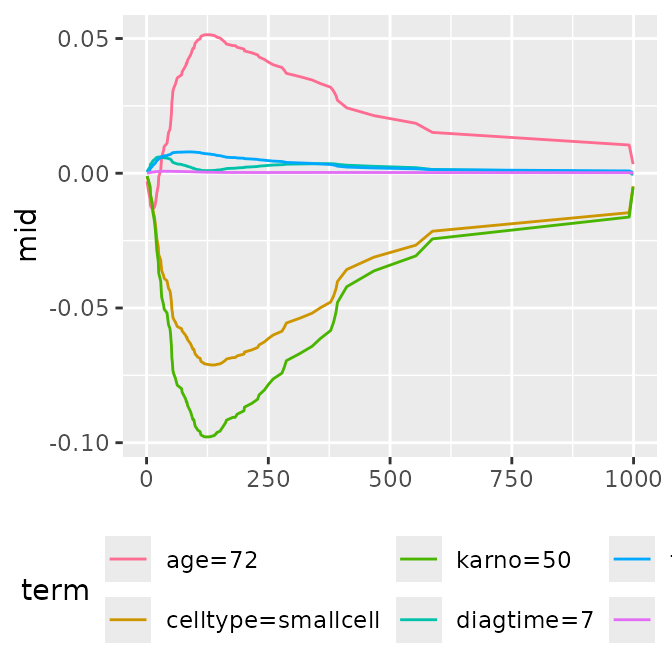

    #> $data
    #>     term label          mid
    #> 1 age=72     1 -0.002957693
    #> 2 age=72    10 -0.012751333
    #> 3 age=72   100  0.048345388
    #> 
    #> $mapping
    #> Aesthetic mapping: 
    #> * `x` -> `.data[["label"]]`
    #> * `y` -> `.data[["mid"]]`

``` r
p1 <- ggmid(brks, fill = .transparent) +
  geom_boxplot()
p2 <- ggmid(brks, fill = .transparent) +
  geom_jitter(aes(color = label), width = 0) +
  scale_color_theme("mako")
p3 <- ggmid(brks, type = "series", color = .transparent) +
  geom_area(aes(fill = term)) +
  scale_fill_theme("light")

p1 + p2 + p3
```

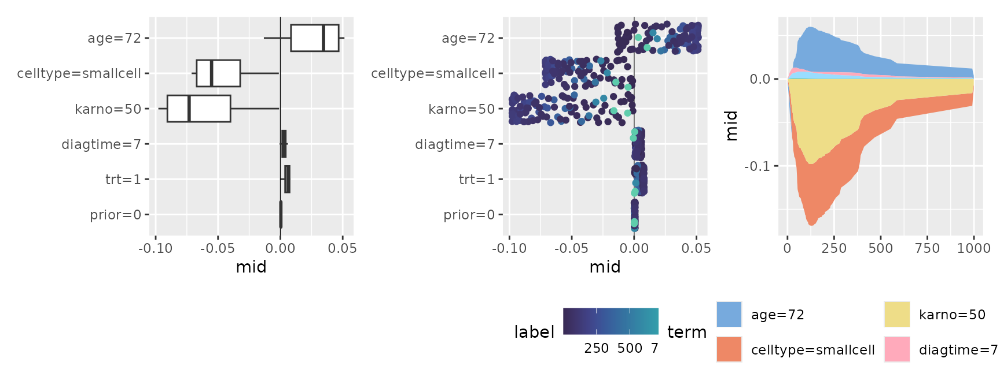

### Conditional Expectation

Finally, let’s look at the transition of conditional expectations across
multiple models or time axes. By utilizing `facet_grid(~ .id)`, you can
split the panels by time (the model’s index) and compare side-by-side
how the shape of the expectation evolves.

``` r
cons <- mid.conditional(mids, variable = "karno",
                        max.nsamples = 3L, data = veteran[1:3, ])
p1 <- ggmid(cons)
p2 <- ggmid(cons, type = "centered")
p1 + p2
```

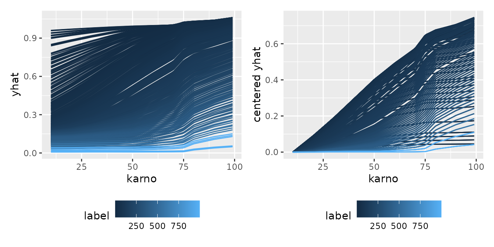

    #> $data
    #>   .id      yhat Surv.time..status. trt celltype karno diagtime age prior label
    #> 1   1 0.9973367                 72   1 squamous    60        7  69     0     1
    #> 2   2 1.0018733                411   1 squamous    70        5  64    10     1
    #> 3   3 0.9957201                228   1 squamous    60        3  38     0     1
    #>   centered yhat
    #> 1    0.03776301
    #> 2    0.04090414
    #> 3    0.03776301
    #> 
    #> $mapping
    #> Aesthetic mapping: 
    #> * `x` -> `.data[["karno"]]`
    #> * `y` -> `.data[["centered yhat"]]`

``` r
ggmid(cons, theme = "mako", type = "centered", reference = 50) +
  facet_grid(~ .id)
```

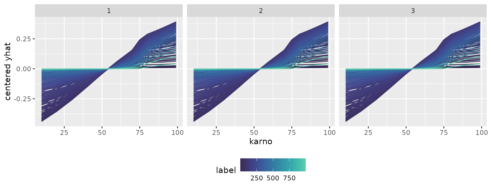

``` r
p1 <- ggmid(cons, type = "series")
p1
```

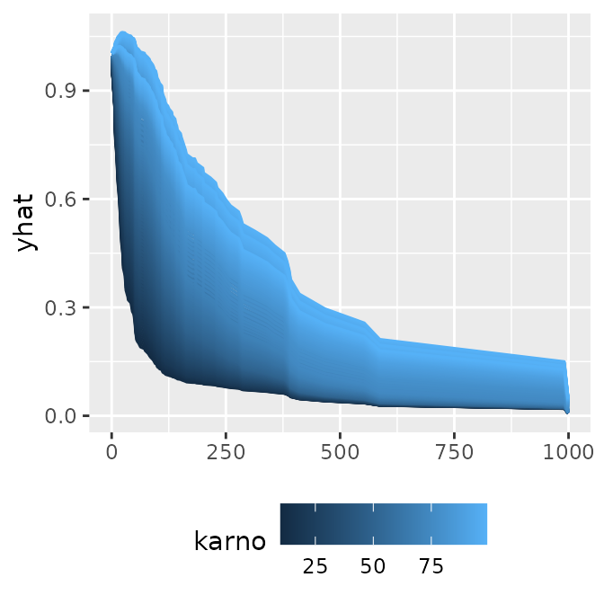

    #> $data
    #>   .id      yhat Surv.time..status. trt celltype karno diagtime age prior label
    #> 1   1 0.9973367                 72   1 squamous    60        7  69     0     1
    #> 2   2 1.0018733                411   1 squamous    70        5  64    10     1
    #> 3   3 0.9957201                228   1 squamous    60        3  38     0     1
    #> 
    #> $mapping
    #> Aesthetic mapping: 
    #> * `x` -> `.data[["label"]]`
    #> * `y` -> `.data[["yhat"]]`

``` r
ggmid(cons, theme = "mako", type = "series") +
  facet_grid(~ .id)
```

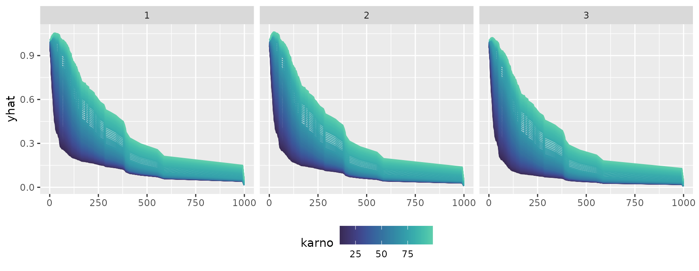
