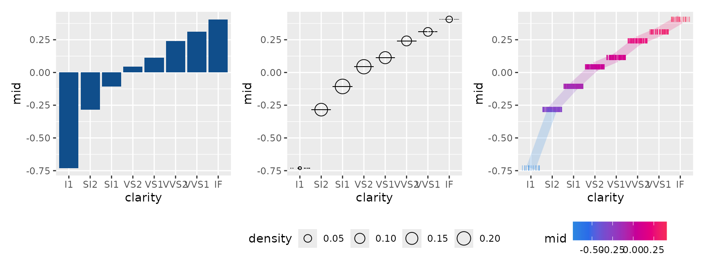
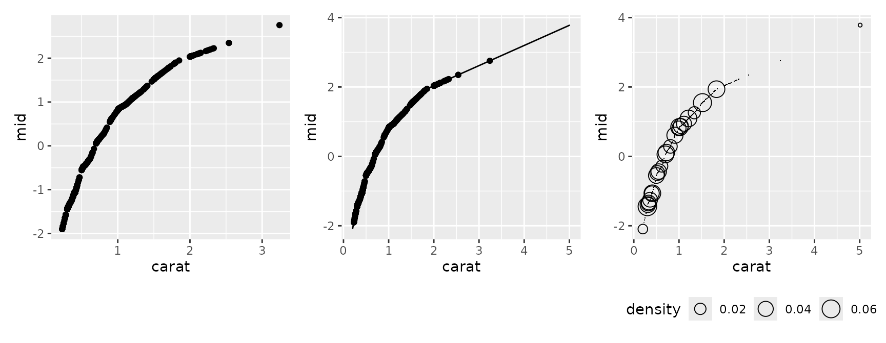

# Visualization with ggplot2 package

This article showcases visualizations of MID models using the
[`ggmid()`](https://ryo-asashi.github.io/midr/reference/ggmid.md)
function with **ggplot2** functions.

``` r
library(midr)
library(ggplot2)
library(patchwork)
theme_set(theme(legend.position = "bottom"))
.transparent <- "#ffffff00"
```

## Single MID Model

``` r
# fit a MID model
mid <- interpret(
  log(price) ~ (carat + cut + color + clarity) ^ 2,
  k = 5L,
  lamp = "auto",
  data = diamonds,
  verbosity = 0L
)
diamonds_sample <- diamonds[sample(nrow(diamonds), 1000L), ]
mid$call$data <- quote(diamonds_sample)
```

### First-Order Effect (Numeric Variable)

``` r
p1 <- ggmid(mid, term = "carat", linewidth = 2, color = "dodgerblue4")
p2 <- ggmid(mid, term = "carat", type = "data", shape = ".") +
  geom_point(aes(size = density), shape = 1L)
p3 <- ggmid(mid, term = "carat", type = "data", theme = "shap") +
  geom_line(linewidth = 4, alpha = .2)
p1 + p2 + p3
```


### First-Order Effect (Factor Variable)

``` r
p1 <- ggmid(mid, term = "clarity", fill = "dodgerblue4")
p2 <- ggmid(mid, term = "clarity", type = "data", shape = ".") +
  geom_point(aes(size = density), shape = 1L)
p3 <- ggmid(mid, term = "clarity", type = "data", theme = "shap", shape = "|") +
  geom_line(aes(group = NA), linewidth = 4, alpha = .2)
p1 + p2 + p3
```



### Second-Order Effect

``` r
p1 <- ggmid(mid, term = "carat:clarity", main.effects = TRUE)
p2 <- ggmid(mid, term = "carat:clarity", type = "data",
            theme = "mako", main.effects = TRUE) +
  geom_blank()
p3 <- ggmid(mid, term = "carat:clarity", type = "data",
            theme = "shap", main.effects = TRUE) +
  geom_line(aes(group = clarity, color = mid), linewidth = 4, alpha = .2)
p1 + p2 + p3
```


### Feature Importance

``` r
imp <- mid.importance(mid)
p1 <- ggmid(imp, type = "heatmap", color = "gray20")
p2 <- ggmid(imp, type = "heatmap", theme = "mako") +
  geom_text(aes(label = round(importance, 2)), color = "white")
p3 <- ggmid(imp, type = "heatmap", fill = .transparent) +
  geom_point(aes(size = importance), color = "steelblue")
p1 + p2 + p3
```


``` r
p1 <- ggmid(imp, type = "barplot")
p2 <- ggmid(imp, type = "dotchart")
p3 <- ggmid(imp, type = "boxplot")
p1 + p2 + p3
```



### Prediction Breakdown

``` r
brk <- mid.breakdown(mid, row = 1L)
p1 <- ggmid(brk)
p2 <- ggmid(brk, fill = .transparent, color = .transparent) +
  geom_linerange(aes(xmax = xmax, xmin = xmin, color = mid), linewidth = 4) +
  geom_tile(aes(color = mid)) +
  scale_color_theme("bicolor")
p3 <- ggmid(brk, type = "dotchart")
p1 + p2 + p3
```


## Collection of MID Models

``` r
library(survival)
sreg <- coxph(
  Surv(time, status) ~ .,
  data = veteran
)
mids <- interpret(
  Surv(time, status) ~ .,
  data = veteran,
  model = sreg,
  lambda = 1
)
```

## ggmid.mids()

``` r
p1 <- ggmid(mids, "celltype", type = "series", intercept = TRUE)
summary(p1)
```

    #> data: celltype, label, mid [404x3]
    #> mapping:  x = ~.data[["label"]], y = ~.data[["mid"]]
    #> scales:   colour, y, ymin, ymax, yend, yintercept, ymin_final, ymax_final, lower, middle, upper, y0 
    #> faceting:  <empty> 
    #> -----------------------------------
    #> mapping: colour = ~.data[["celltype"]], group = ~.data[["celltype"]] 
    #> geom_line: na.rm = FALSE, orientation = NA, arrow = NULL, arrow.fill = NULL, lineend = butt, linejoin = round, linemitre = 10
    #> stat_identity: na.rm = FALSE
    #> position_identity

``` r
p2 <- ggmid(
  mids, "celltype", type = "series", intercept = TRUE, color = "#00000000"
  ) +
  geom_line(
    aes(x = as.numeric(label), y = intercept),
    data.frame(label = labels(mids), intercept = mids$intercept),
    linewidth = 2, alpha = .1
  ) +
  geom_line(aes(linetype = celltype))
p1 + p2
```


