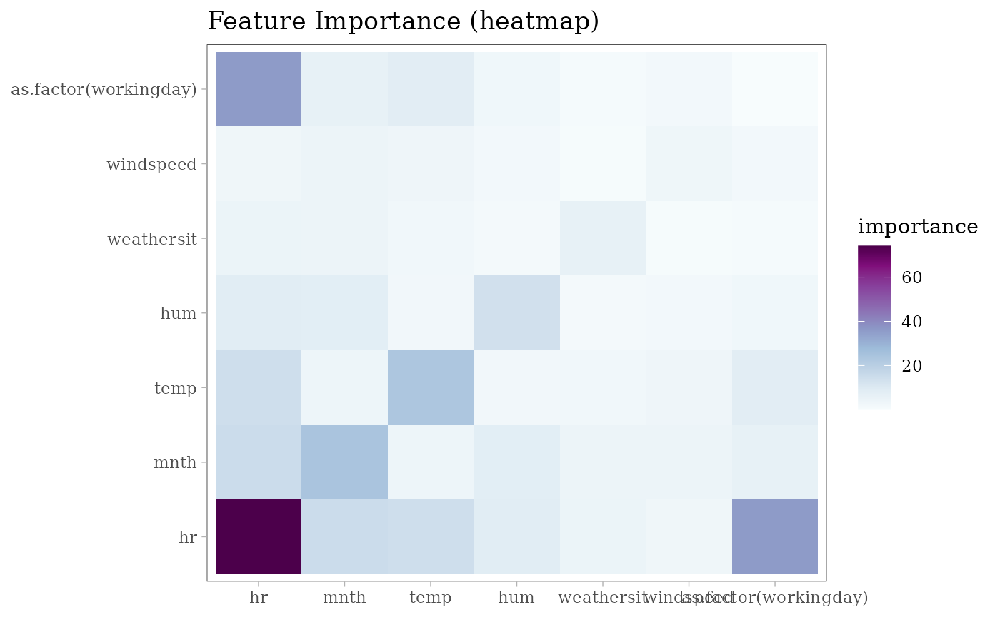
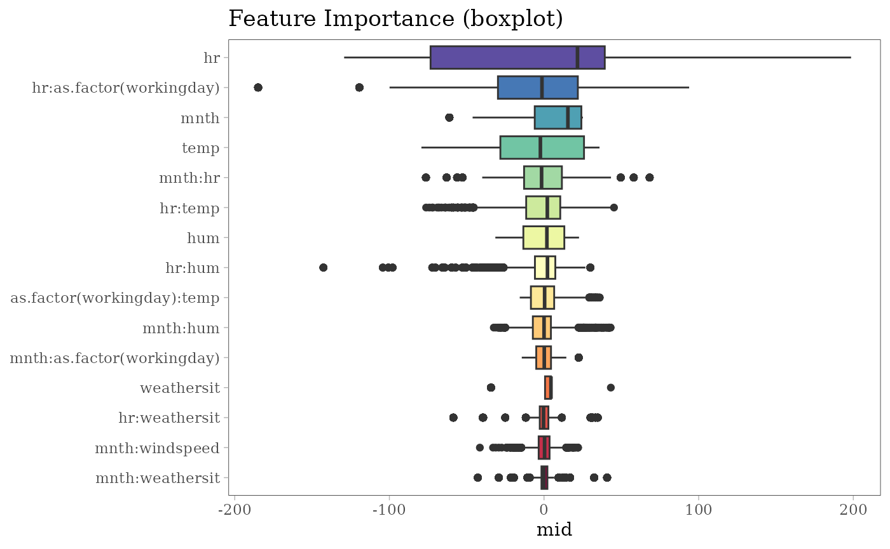
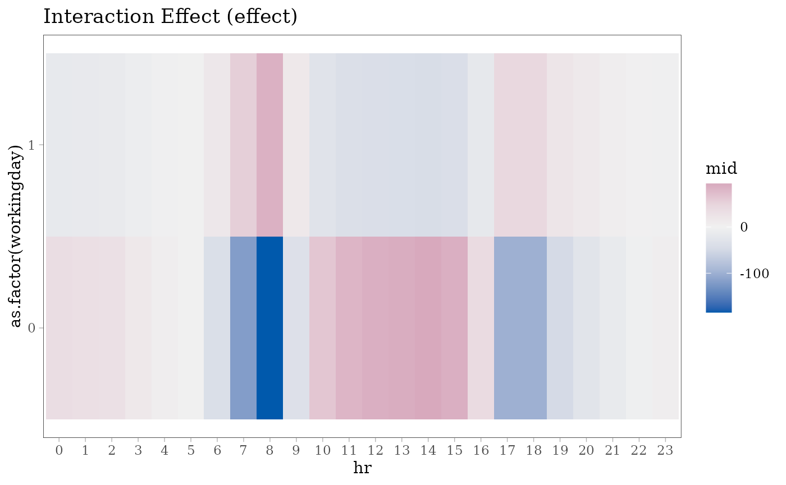
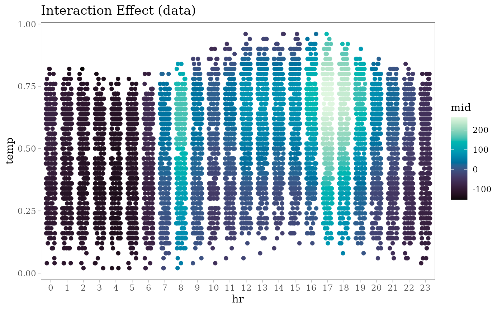
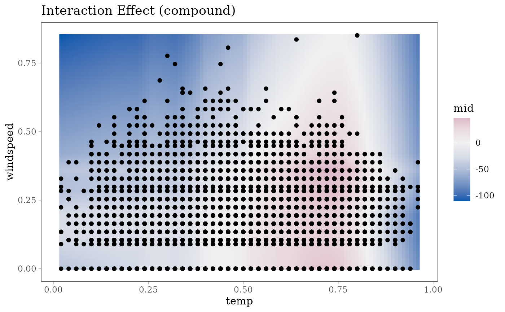
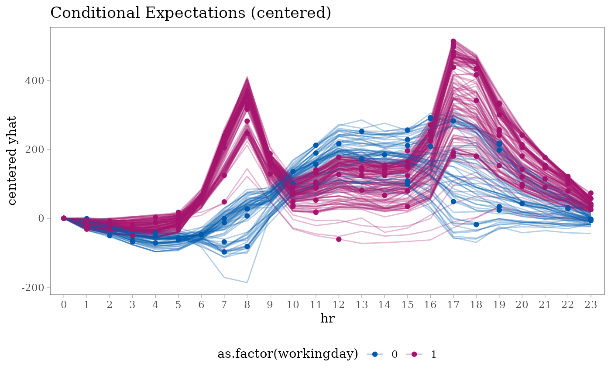
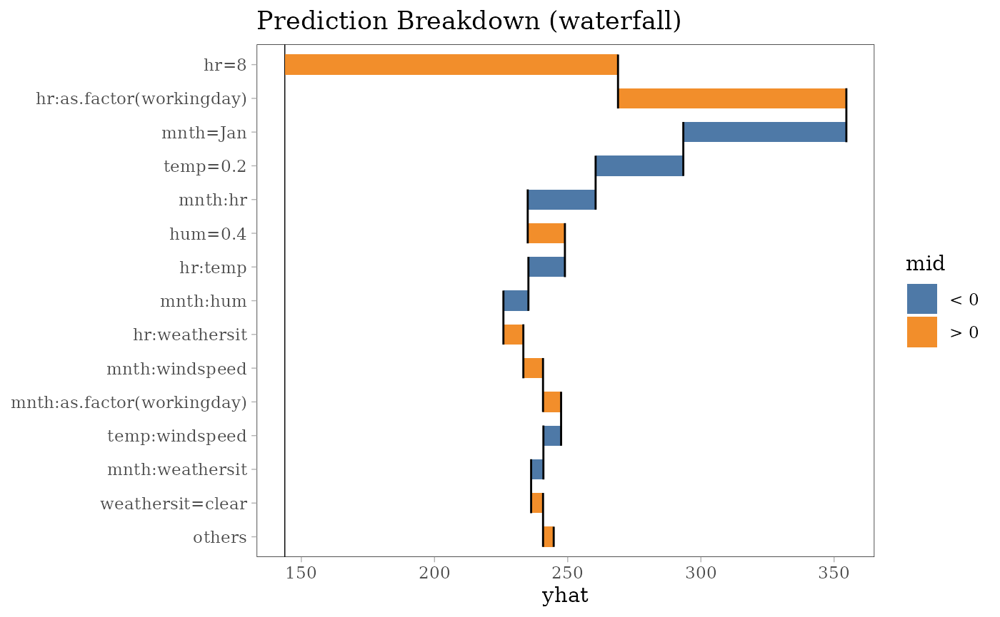
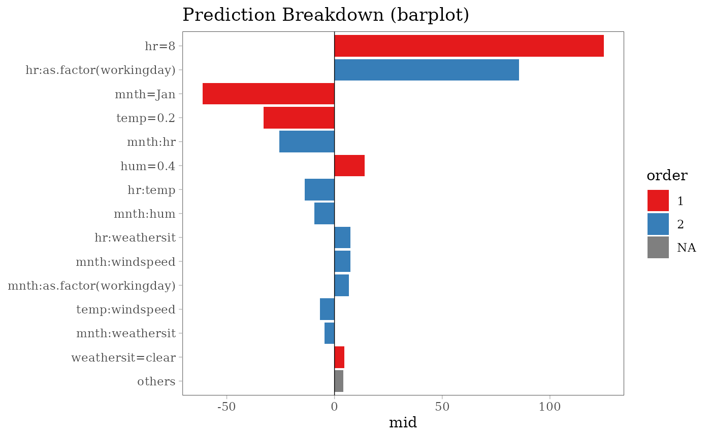
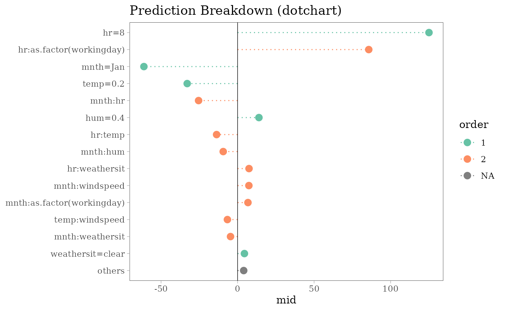

# Visualization with ggplot2 package

``` r
# load required packages
library(midr)
library(ISLR2)
library(ggplot2)
theme_set(theme_midr())

# train a predictive MID model
mid <- interpret(
  bikers ~ (mnth + hr + as.factor(workingday) +
    weathersit + temp + hum + windspeed)^2, # model formula
  data = Bikeshare, # training data
  lambda = .01 # smoothing parameter
)
#> 'model' not passed: response variable in 'data' is used
```

## Feature Importance

``` r
# compute MID based variable importance
imp <- mid.importance(mid)

# create importance plots
ggmid(imp, theme = "Temps", max = 15) +
  ggtitle('Feature Importance (barplot)')
```


``` r
ggmid(imp, type = "dotchart", theme = "Set 1", max = 15, cex = 3) +
  ggtitle('Feature Importance (dotchart)')
```


``` r
ggmid(imp, type = "heatmap", theme = "BuPu") +
  ggtitle('Feature Importance (heatmap)')
```



``` r
ggmid(imp, type = "boxplot", theme = "Spectral", max = 15) +
  ggtitle('Feature Importance (boxplot)')
```



## Component Functions

``` r
# create component plots
ggmid(mid, term = "temp") +
  ggtitle('Main Effect (effect)')
```


``` r
ggmid(mid, term = "hr") +
  ggtitle('Main Effect (effect)')
```


``` r
ggmid(mid, term = "hr:as.factor(workingday)") +
  ggtitle('Interaction Effect (effect)')
```



``` r
ggmid(mid, term = "hr:temp", type = "data",
     main.effects = TRUE, theme = "Mako", data = Bikeshare) +
  ggtitle('Interaction Effect (data)')
```



``` r
ggmid(mid, term = "temp:windspeed", type = "compound",
     main.effects = TRUE, data = Bikeshare) +
  ggtitle('Interaction Effect (compound)')
```



## Conditional Expectations

``` r
# compute ICE plots
set.seed(42)
ice_rows <- sample(nrow(Bikeshare), 200L)
ice <- mid.conditional(mid, variable = "hr",
                       data = Bikeshare[ice_rows, ])
# create plots
ggmid(ice, theme = "Cividis", var.color = mnth == "Aug") +
  ggtitle('Conditional Expectations (iceplot)') +
  theme(legend.position = "bottom")
```


``` r
ggmid(ice, term = "hr:temp", dots = FALSE,
     theme = "Temps", var.color = temp) +
  ggtitle('Conditional Expectations (iceplot)')
```


``` r
ggmid(ice, type = "centered", alpha = .3,
     theme = "midr", var.color = `as.factor(workingday)`) +
  ggtitle('Conditional Expectations (centered)') +
  theme(legend.position = "bottom")
```



## Prediction Breakdown

``` r
# compute MID breakdown for the individual penguins
bd100 <- mid.breakdown(mid, Bikeshare[100L, ])

# create plots
ggmid(bd100, theme = "Tableau 10") +
  ggtitle('Prediction Breakdown (waterfall)')
```



``` r
ggmid(bd100, type = "barplot", theme = "Set 1") +
  ggtitle('Prediction Breakdown (barplot)')
#> Warning in ggplot2::geom_col(width = width, ...): Ignoring empty
#> aesthetic: `width`.
```



``` r
ggmid(bd100, type = "dotchart", theme = "Set 2", cex = 3) +
  ggtitle('Prediction Breakdown (dotchart)')
```


