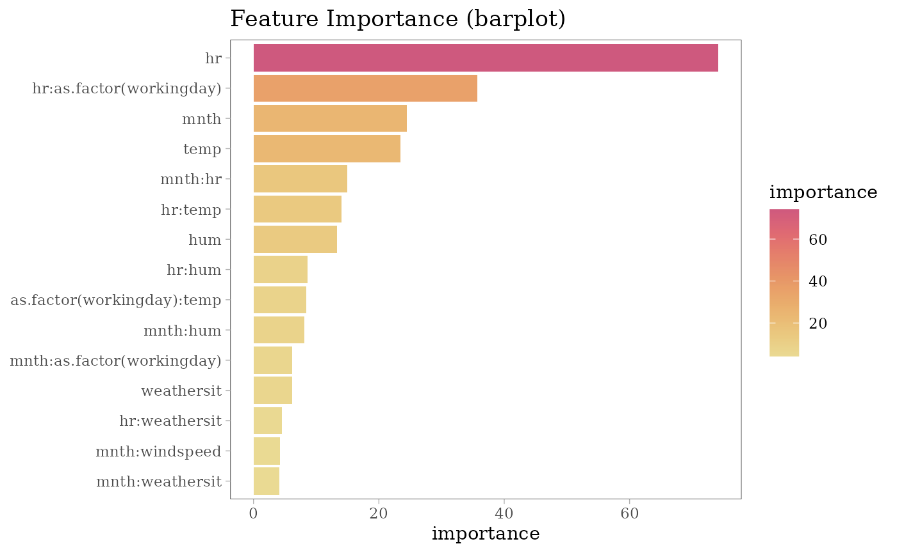

# Visualization with ggplot2 package

``` r
# load required packages
library(midr)
library(ISLR2)
library(ggplot2)
library(patchwork)
theme_set(theme_midr("y"))

# train a predictive MID model
mid <- interpret(
  cbind(bikers, casual, registered) ~ (
    mnth + hr + factor(workingday) + weathersit + temp + hum + windspeed
  )^2 # model formula
  , link = "log"
  , data = Bikeshare # training data
  , lambda = .05 # smoothing parameter
  , subset = casual * registered > 0
)
#> 'model' not passed: response variable in 'data' is used
```

## Feature Importance

``` r
# compute MID based variable importance
imp <- mid.importance(mid)

# create importance plots
p1 <- ggmid(imp[[1]], type = "box", max.nterms = 10) +
  labs(subtitle = "Effect on Total Bike Rentals (log-scale)") +
  theme(legend.position = "none")
p2 <- ggmid(imp[[2]], max.nterms = 10, fill = "maroon", width = .6) +
  labs(subtitle = "Casual Bikers") +
  theme(legend.position = "none")
p3 <- ggmid(imp[[3]], max.nterms = 10, fill = "steelblue", width = .6) +
  labs(subtitle = "Registered Bikers") +
  theme(legend.position = "none")
p1 / (p2 + p3)
```



## Component Functions

``` r
# create component plots
p1 <- ggmid(mid[[2]], "hr", fill = "maroon", width = .8) +
  labs(subtitle = "Main Effect of Hour (Casual Bikers)")
p2 <- ggmid(mid[[2]], "factor(workingday)", fill = "maroon", width = .8) +
  labs(subtitle = "Main Effect of Workingday (Casual Bikers)")
p3 <- ggmid(mid[[2]], "temp") +
  labs(subtitle = "Main Effect of Temperature (Casual Bikers)")
p4 <- ggmid(mid[[2]], "hr:factor(workingday)", main.effects = TRUE) +
  labs(subtitle = "Total Effect of Hour:Workingday (Casual Bikers)") +
  theme(legend.position = "none")
(p1 + p2) / (p3 + p4)
```


``` r
# create component plots
p1 <- ggmid(mid[[3]], "hr", fill = "steelblue", width = .8) +
  labs(subtitle = "Main Effect of Hour (Registered Bikers)")
p2 <- ggmid(mid[[3]], "mnth", fill = "steelblue", width = .8) +
  labs(subtitle = "Main Effect of Month (Registered Bikers)")
p3 <- ggmid(mid[[3]], "temp") +
  labs(subtitle = "Main Effect of Temperature (Registered Bikers)")
p4 <- ggmid(
  mid[[3]],
  "hr:factor(workingday)",
  main.effects = TRUE
) +
  labs(subtitle = "Total Effect of Hour:Workingday (Registered Bikers)") +
  theme(legend.position = "none")
(p1 + p2) / (p3 + p4)
```


## Conditional Expectations

``` r
# compute ICE plots
set.seed(42)
ice_rows <- sample(nrow(Bikeshare), 200L)
ice <- mid.conditional(
  mid[2:3]
  , max.nsamples = 200
  , variable = "hr"
  , data = Bikeshare[ice_rows, ]
)
# create plots
p1 <- ggmid(
  ice[[1]]
  , theme = "muted"
  , var.color = `factor(workingday)`
) +
  labs(subtitle = "Casual Bikers") +
  ylim(0, 600)
p2 <- ggmid(
  ice[[2]]
  , theme = "muted"
  , var.color = `factor(workingday)`
) +
  labs(subtitle = "Registered Bikers") +
  ylim(0, 600)
p1 / p2
```


## Prediction Breakdown

``` r
# compute MID breakdown for the individual penguins
bd100 <- mid.breakdown(mid[2:3], data = Bikeshare, row = 100)

# create plots
ordered <- mid.terms(bd100[[1]])
p1 <- ggmid(
  bd100[[1]]
  , fill = "maroon"
  , terms = ordered
) + 
  theme(legend.position = "none") +
  labs(subtitle = "Casual Bikers") +
  xlim(0, 3)

p2 <- ggmid(
  bd100[[2]]
  , fill = "steelblue"
  , terms = ordered
) +
  theme(legend.position = "none") +
  scale_y_discrete(labels = NULL) +
  labs(subtitle = "Registered Bikers") +
  xlim(3, 6)
p1 + p2
```


