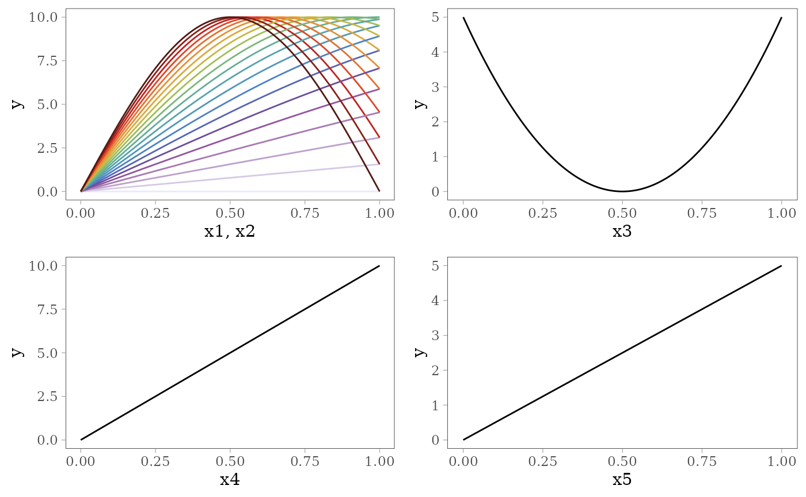
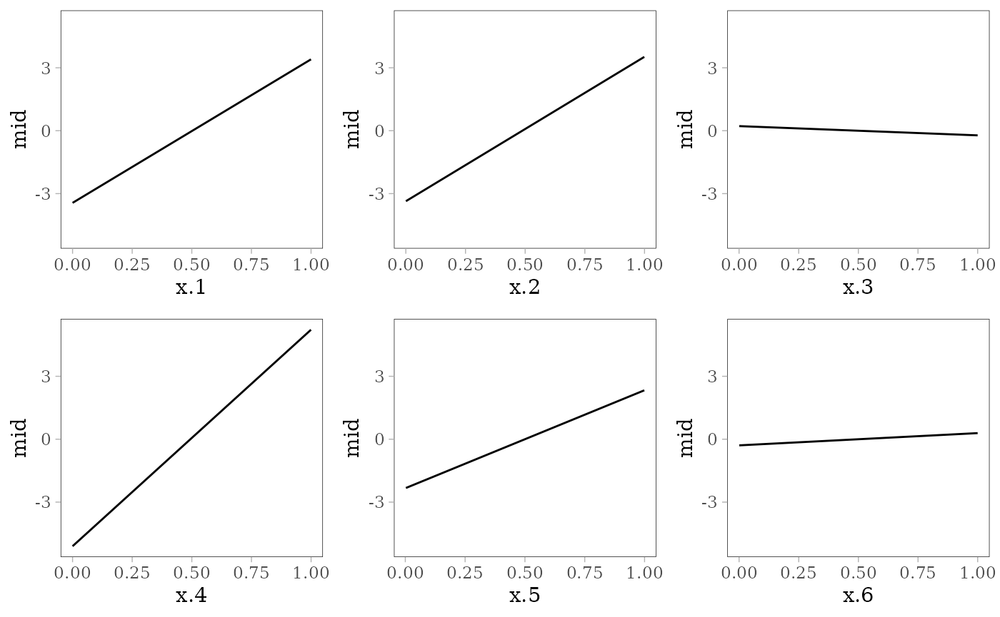
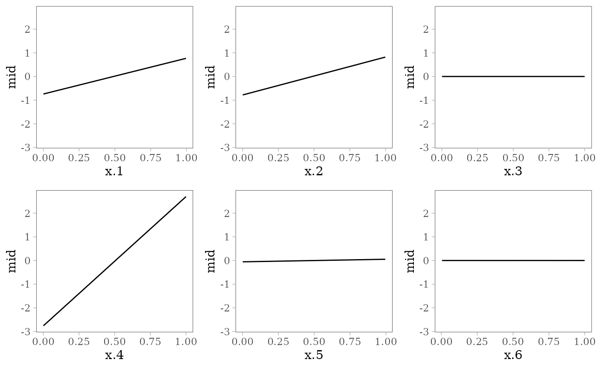
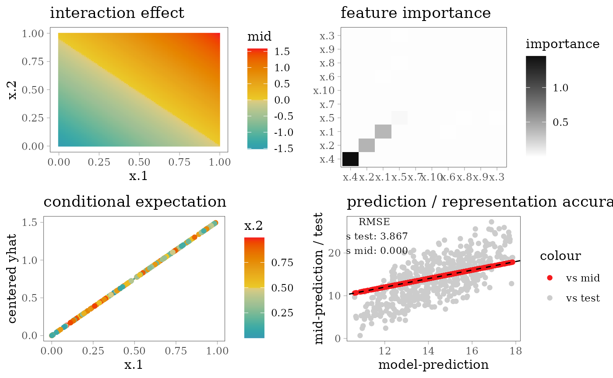
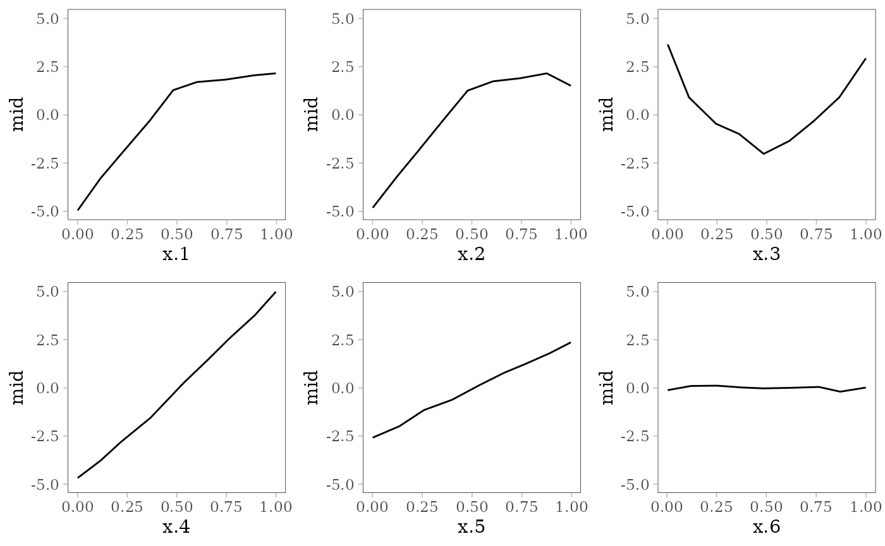
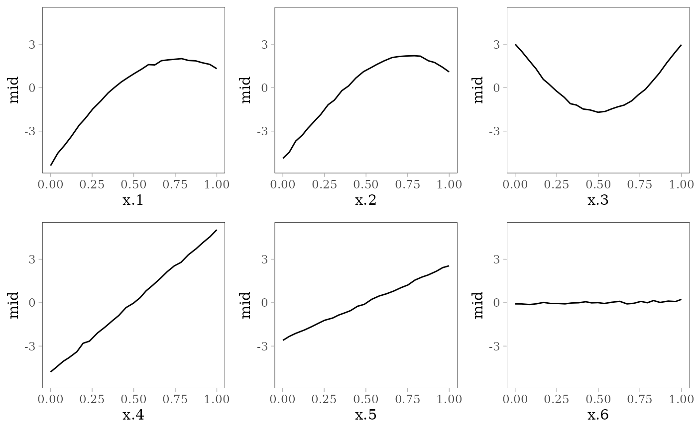
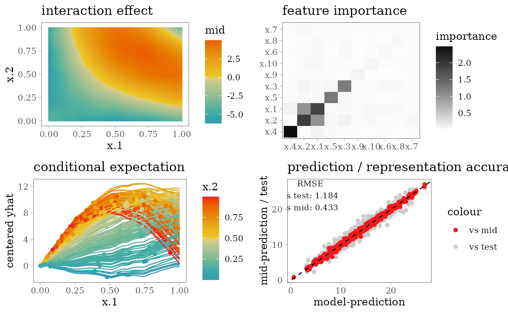
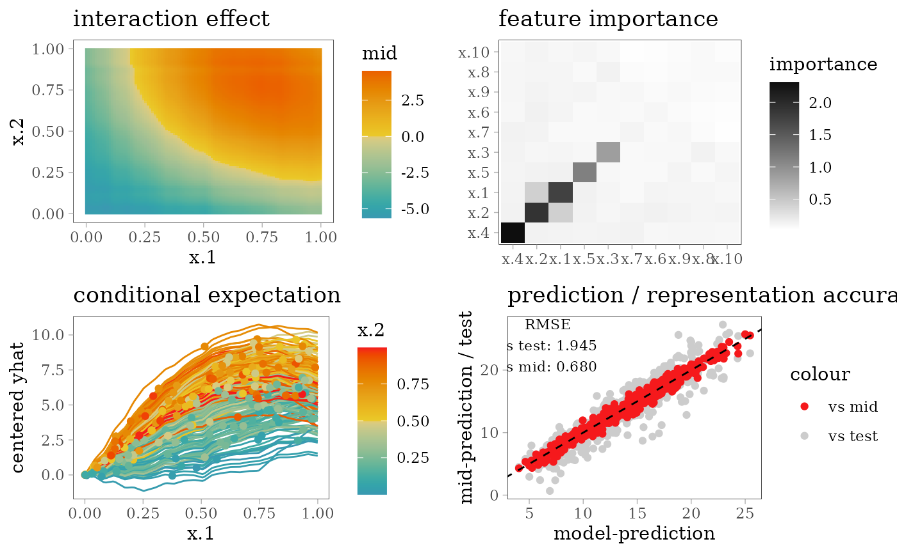
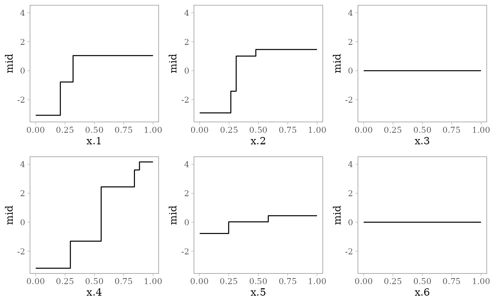
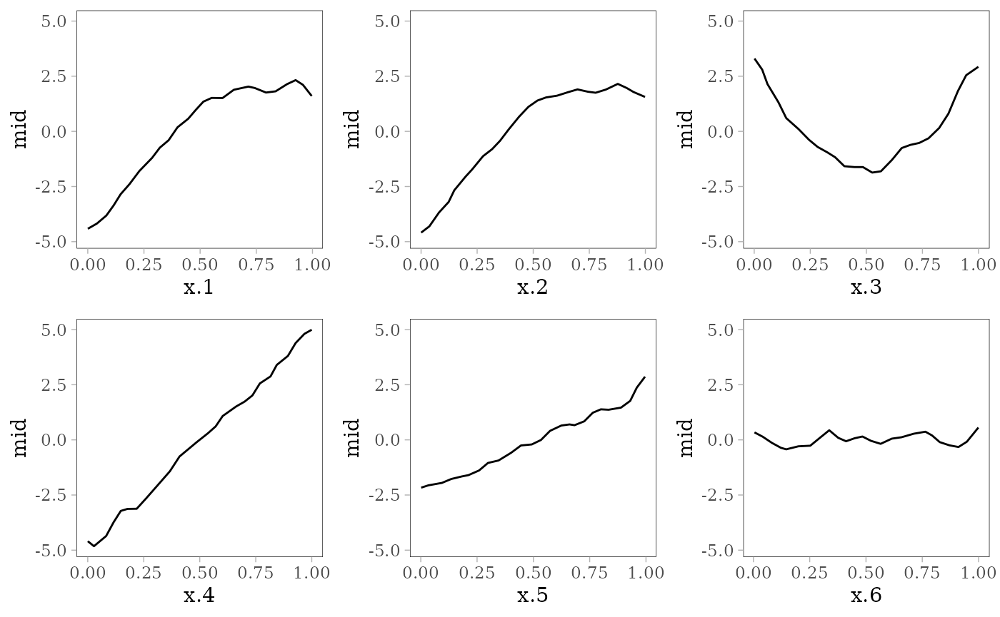

# Interpretation of Regression Models

This article presents some examples of the interpretation of regression
models using `midr`.

``` r
# load required packages
library(midr)
library(ggplot2)
library(gridExtra)
library(patchwork)
library(Metrics)
theme_set(theme_midr())
```

## Regression Task

We use a benchmark regression task, originally described in Friedman
(1991) and Breiman (1996), and implemented in the `mlbench` package. The
dataset has 10 independent predictor variables $x_{1},x_{2},...,x_{10}$
each uniformly distributed on the interval $\lbrack 0,1\rbrack$, and the
response variable $y$ , generated according to the following formula
with disturbance term $\epsilon\  \sim \ \mathcal{N}(0,1)$.
$$y = 10\sin{\left( \pi x_{1}x_{2} \right) + 20\left( x_{3} - 0.5 \right)^{2} + 10x_{4} + 5x_{5} + \epsilon}$$

The following plots show the effect of each predictor variable on the
response. For $x_{1}$ and $x_{2}$ , the interaction effect is shown by
the colored lines: the effect of $x_{1}$ depends on the value of $x_{2}$
(pale purple for 0 and dark red for 1) and *vice versa*.



``` r
# benchmark regression task
library(mlbench)
set.seed(42)
train  <- as.data.frame(mlbench.friedman1(n = 500L))
test   <- as.data.frame(mlbench.friedman1(n = 500L))
mtrain <- as.data.frame(mlbench.friedman1(n = 2500L))[, -11L]
```

For each model type, we fit a regression model using the `train` data of
500 observations and an interpretative MID surrogate of the target model
using the `mtrain` data of 2500 observations without the response
variable. We then evaluate the predictive accuracy of the target model
and the interpretative accuracy of the MID surrogate based on the RMSE
between the `test` and model prediction or the two predictions,
respectively.

``` r
# define utility functions for the following chunks
effect_plots <- function(object) {
  mid.plots(object, terms = paste("x", 1:6, sep = "."))
}

interaction_plot <- function(object) {
  ggmid(object, "x.1:x.2", main.effects = TRUE, theme = "sunset") +
    ggtitle("interaction effect")
}

ice_theme <- color.theme("mako")
ice_plot <- function(object, data = train[1:200, ]) {
  ggmid(mid.conditional(object, "x.1", data = data),
        var.color = x.2, type = "centered", theme = ice_theme) +
    ggtitle("conditional expectation")
}

importance_plot <- function(object) {
  ggmid(mid.importance(object), "heatmap") +
    ggtitle("feature importance")
}

eval_plot <- function(model, mid, data = test, ...) {
  pred <- get.yhat(model, data, ...)
  pred_mid <- get.yhat(mid, data)
  actual <- test$y
  rmse_vs_test <- rmse(pred, actual)
  rmse_vs_mid <-  rmse(pred, pred_mid)
  ggplot() + scale_color_theme("highlight?accent='steelblue'") +
    geom_point(aes(x = pred, y = actual, col = "vs test")) +
    geom_point(aes(x = pred, y = pred_mid, col = "vs mid")) +
    geom_abline(slope = 1, intercept = 0, col = "black", lty = 2) +
    labs(x = "model-prediction", y = "mid-prediction / test") +
    annotate(
      "text", family = "serif", size = 3,
      x = min(pred) + diff(range(pred)) / 8,
      y = max(actual) - diff(range(actual) / 8),
      label = sprintf("RMSE\nvs test: %.3f\nvs mid: %.3f",
                      rmse_vs_test, rmse_vs_mid)
    ) + ggtitle("prediction / representation accuracy")
}
```

## Additive Models

### Linear Model

``` r
model <- lm(y ~ ., train)
coef(model)
#> (Intercept)         x.1         x.2         x.3         x.4         x.5 
#>   0.1302510   6.8458545   6.8892805  -0.4403955  10.3264576   4.6735425 
#>         x.6         x.7         x.8         x.9        x.10 
#>   0.5837944   0.2030152  -0.6272202  -0.1722106   0.3453933
mid <- interpret(y ~ .^2, mtrain, model)
print(mid)
#> 
#> Call:
#> interpret(formula = ~.^2, data = mtrain, model = model)
#> 
#> Model Class: lm
#> 
#> Intercept: 14.319
#> 
#> Main Effects:
#> 10 main effect terms
#> 
#> Interactions:
#> 45 interaction terms
#> 
#> Uninterpreted Variation Ratio: 0
grid.arrange(grobs = effect_plots(mid), nrow = 2L)
```



``` r
grid.arrange(interaction_plot(mid), importance_plot(mid),
             ice_plot(mid), eval_plot(model, mid), nrow = 2)
```


### Regularized GLM

``` r
library(glmnet)
model <- glmnet(x = as.matrix(train[, -11]), y = train[, 11])
# prediction with arbitrarily chosen lambda
mid <- interpret(y ~ .^2, train[, -11], model,
                 pred.args = list(s = model$lambda[9]))
print(mid)
#> 
#> Call:
#> interpret(formula = ~.^2, data = train[, -11], model = model,
#>  pred.args = list(s = model$lambda[9]))
#> 
#> Model Class: elnet, glmnet
#> 
#> Intercept: 14.417
#> 
#> Main Effects:
#> 10 main effect terms
#> 
#> Interactions:
#> 45 interaction terms
#> 
#> Uninterpreted Variation Ratio: 0
grid.arrange(grobs = effect_plots(mid), nrow = 2L)
```



``` r
evp <- eval_plot(model, mid, data = test[, -11],
                       s = model$lambda[9])
grid.arrange(interaction_plot(mid), importance_plot(mid),
             ice_plot(mid), evp, nrow = 2)
```



### Generalized Additive Model

``` r
library(gam)
model <- gam(y ~ s(x.1) + s(x.2) + s(x.3) + s(x.4) + s(x.5) +
             s(x.6) + s(x.7) + s(x.8) + s(x.9) + s(x.10),
             family = gaussian, data = train)
mid <- interpret(y ~ .^2, train, model)
print(mid)
#> 
#> Call:
#> interpret(formula = y ~ .^2, data = train, model = model)
#> 
#> Model Class: Gam, glm, lm
#> 
#> Intercept: 14.417
#> 
#> Main Effects:
#> 10 main effect terms
#> 
#> Interactions:
#> 45 interaction terms
#> 
#> Uninterpreted Variation Ratio: 0
grid.arrange(grobs = effect_plots(mid), nrow = 2L)
```


``` r
grid.arrange(interaction_plot(mid), importance_plot(mid),
             ice_plot(mid), eval_plot(model, mid), nrow = 2)
```


### Multivariate Adaptive Regression Spline

``` r
library(earth)
model <- earth(y ~ ., degree = 2, data = train)
mid <- interpret(y ~ .^2, train, model)
print(mid)
#> 
#> Call:
#> interpret(formula = y ~ .^2, data = train, model = model)
#> 
#> Model Class: earth
#> 
#> Intercept: 14.417
#> 
#> Main Effects:
#> 10 main effect terms
#> 
#> Interactions:
#> 45 interaction terms
#> 
#> Uninterpreted Variation Ratio: 0.0022028
grid.arrange(grobs = effect_plots(mid), nrow = 2L)
```



``` r
grid.arrange(interaction_plot(mid), importance_plot(mid),
             ice_plot(mid), eval_plot(model, mid), nrow = 2)
```


## Neural Network

### Single Hidden Layer Network

``` r
library(nnet)
set.seed(42)
model <- nnet(y ~ ., train, size = 5, linout = TRUE, maxit = 1e3, trace = FALSE)
mid <- interpret(y ~ .^2, mtrain, model)
print(mid)
#> 
#> Call:
#> interpret(formula = ~.^2, data = mtrain, model = model)
#> 
#> Model Class: nnet.formula, nnet
#> 
#> Intercept: 14.195
#> 
#> Main Effects:
#> 10 main effect terms
#> 
#> Interactions:
#> 45 interaction terms
#> 
#> Uninterpreted Variation Ratio: 0.00281
grid.arrange(grobs = effect_plots(mid), nrow = 2L)
```



``` r
grid.arrange(interaction_plot(mid), importance_plot(mid),
             ice_plot(mid), eval_plot(model, mid), nrow = 2)
```



## Support Vector Machine

### RBF Kernel SVM

``` r
library(e1071)
#> 
#> Attaching package: 'e1071'
#> The following object is masked from 'package:ggplot2':
#> 
#>     element
model <- svm(y ~ ., train, kernel = "radial")
mid <- interpret(y ~ .^2, mtrain, model)
print(mid)
#> 
#> Call:
#> interpret(formula = ~.^2, data = mtrain, model = model)
#> 
#> Model Class: svm.formula, svm
#> 
#> Intercept: 14.32
#> 
#> Main Effects:
#> 10 main effect terms
#> 
#> Interactions:
#> 45 interaction terms
#> 
#> Uninterpreted Variation Ratio: 0.0075534
grid.arrange(grobs = effect_plots(mid), nrow = 2L)
```


``` r
grid.arrange(interaction_plot(mid), importance_plot(mid),
             ice_plot(mid), eval_plot(model, mid), nrow = 2)
```



## Tree Based Models

### Gradient Boosting Trees

``` r
library(xgboost)
params <- list(eta = .1, subsample = .7, max_depth = 5)
set.seed(42)
model <- xgboost(as.matrix(train[, -11]), train[, 11], nrounds = 100,
                 params = params, verbose = 0)
#> Warning in throw_err_or_depr_msg("Parameter(s) have been removed from this
#> function: ", : Parameter(s) have been removed from this function: params. This
#> warning will become an error in a future version.
#> Warning in throw_err_or_depr_msg("Passed unrecognized parameters: ",
#> paste(head(names_unrecognized), : Passed unrecognized parameters: verbose. This
#> warning will become an error in a future version.
mid <- interpret(y ~ .^2, as.matrix(mtrain), model)
print(mid)
#> 
#> Call:
#> interpret(formula = ~.^2, data = as.matrix(mtrain), model = model)
#> 
#> Model Class: xgboost, xgb.Booster
#> 
#> Intercept: 14.307
#> 
#> Main Effects:
#> 10 main effect terms
#> 
#> Interactions:
#> 45 interaction terms
#> 
#> Uninterpreted Variation Ratio: 0.030268
grid.arrange(grobs = effect_plots(mid), nrow = 2L)
```


``` r
evp <- eval_plot(model, mid, as.matrix(test[, -11]))
grid.arrange(interaction_plot(mid), importance_plot(mid),
             ice_plot(mid), evp, nrow = 2)
```


### Random Forest

``` r
library(ranger)
set.seed(42)
model <- ranger(y ~ ., train, mtry = 5)
mid <- interpret(y ~ .^2, mtrain, model)
print(mid)
#> 
#> Call:
#> interpret(formula = ~.^2, data = mtrain, model = model)
#> 
#> Model Class: ranger
#> 
#> Intercept: 14.27
#> 
#> Main Effects:
#> 10 main effect terms
#> 
#> Interactions:
#> 45 interaction terms
#> 
#> Uninterpreted Variation Ratio: 0.0075659
grid.arrange(grobs = effect_plots(mid), nrow = 2L)
```


``` r
grid.arrange(interaction_plot(mid), importance_plot(mid),
             ice_plot(mid), eval_plot(model, mid), nrow = 2)
```


### Decision Tree

``` r
library(rpart)
model <- rpart(y ~ ., train)
# create encoding frames for CART
frm <- cbind(model$frame, labels(model, collapse = FALSE))
print(t(frm[frm$var != "<leaf>", c("var", "ltemp")]))
#>       1          2        5         11         22         3          7         
#> var   "x.4"      "x.1"    "x.2"     "x.4"      "x.5"      "x.2"      "x.1"     
#> ltemp "< 0.5579" "< 0.21" "< 0.311" "< 0.2953" "< 0.5849" "< 0.2653" "< 0.3184"
#>       14         15         31         62        
#> var   "x.4"      "x.5"      "x.4"      "x.2"     
#> ltemp "< 0.8843" "< 0.2486" "< 0.8413" "< 0.4782"
frames <- lapply(mtrain, range)
frames$x.1 <- c(frames$x.1, .2100, .3184)
frames$x.2 <- c(frames$x.2, .3110, .2653, .4782)
frames$x.4 <- c(frames$x.4, .5579, .2953, .8843, .8413)
frames$x.5 <- c(frames$x.5, .5849, .2486)
mid <- interpret(y ~ .^2, mtrain, model, type = 0, frames = frames)
print(mid)
#> 
#> Call:
#> interpret(formula = ~.^2, data = mtrain, model = model, type = 0,
#>  frames = frames)
#> 
#> Model Class: rpart
#> 
#> Intercept: 14.264
#> 
#> Main Effects:
#> 10 main effect terms
#> 
#> Interactions:
#> 45 interaction terms
#> 
#> Uninterpreted Variation Ratio: 0.031256
grid.arrange(grobs = effect_plots(mid), nrow = 2L)
```



``` r
grid.arrange(interaction_plot(mid), importance_plot(mid),
             ice_plot(mid), eval_plot(model, mid), nrow = 2)
```


## Other Modes

### Predictive MID

``` r
model <- mid <- interpret(y ~ .^2, train, lambda = .2)
#> 'model' not passed: response variable in 'data' is used
pred <- pred_mid <- predict(mid, test)
print(mid)
#> 
#> Call:
#> interpret(formula = y ~ .^2, data = train, lambda = 0.2)
#> 
#> Intercept: 14.417
#> 
#> Main Effects:
#> 10 main effect terms
#> 
#> Interactions:
#> 45 interaction terms
#> 
#> Uninterpreted Variation Ratio: 0.03179
grid.arrange(grobs = effect_plots(mid), nrow = 2L)
```



``` r
grid.arrange(interaction_plot(mid), importance_plot(mid),
             ice_plot(mid), eval_plot(model, mid), nrow = 2)
```


