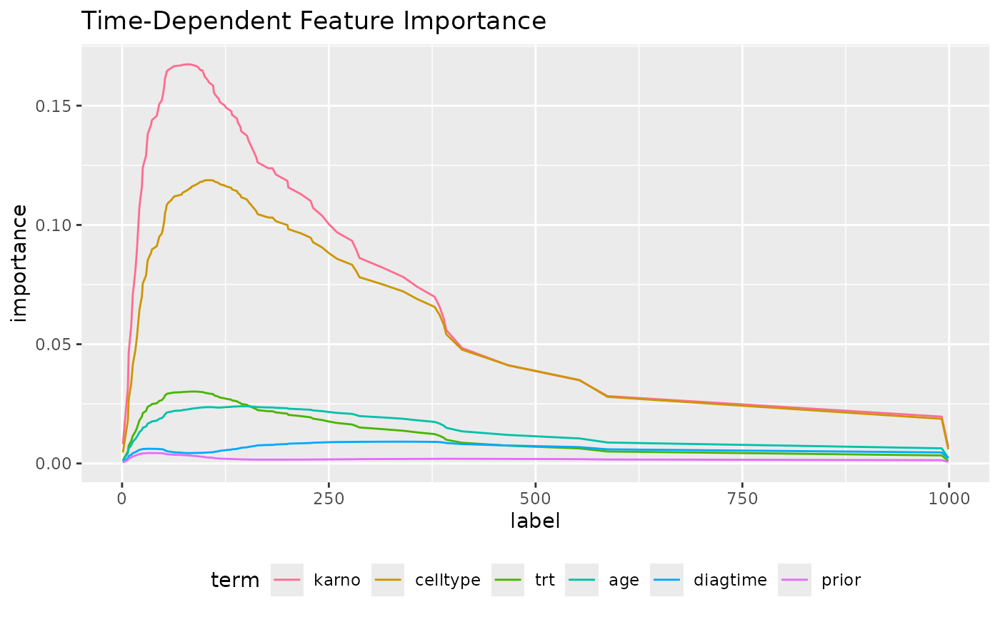
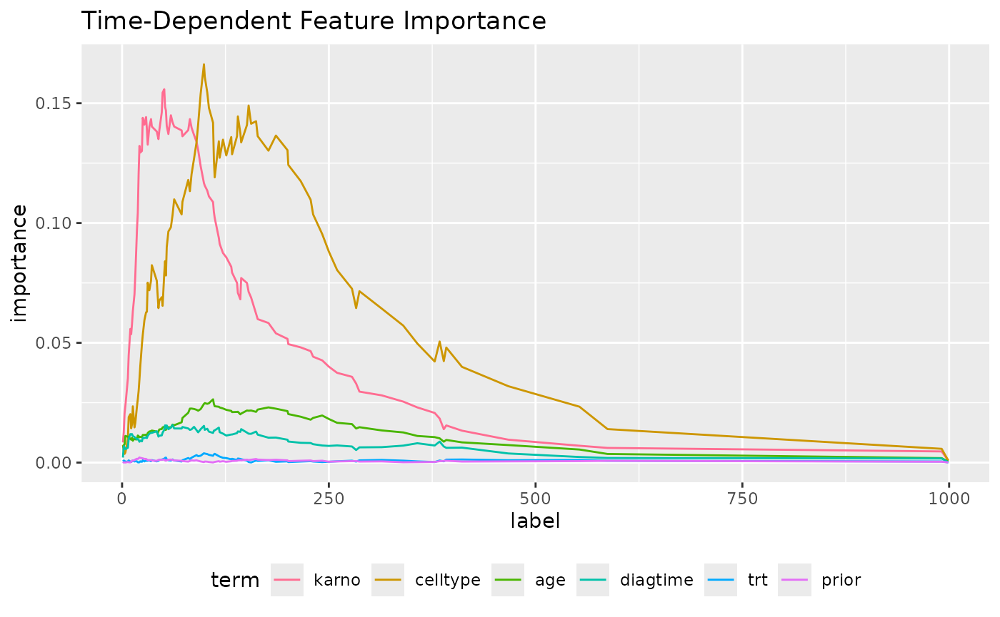

# Interpretation of Survival Models

This article presents some examples of the interpretation of regression
models using `midr`.

``` r
# load required packages
library(midr)
library(ggplot2)
library(gridExtra)
```

### Cox Proportional Hazard Model

``` r
library(survival)
fit_cox <- coxph(
  Surv(time, status) ~ .,
  data = veteran
)

mid_cox <- interpret(
  Surv(time, status) ~ .,
  data = veteran,
  model = fit_cox,
  lambda = .1
)

ggmid(
  mid_cox,
  term = "karno",
  theme = "magma",
  type = "series",
  intercept = TRUE
) + 
  labs(title = "Feature Effect on Survival Curve") + 
  theme(legend.position = "bottom")
```


``` r
imp_cox <- mid.importance(mid_cox)

ggmid(
  imp_cox,
  type = "series"
) +
  labs(title = "Time-Dependent Feature Importance") +
  theme(legend.position = "bottom") +
  guides(color = guide_legend(nrow = 1))
```



### Random Survival Forest

``` r
library(randomForestSRC)
#> 
#>  randomForestSRC 3.5.1 
#>  
#>  Type rfsrc.news() to see new features, changes, and bug fixes. 
#> 
fit_rsf <- rfsrc(
  Surv(time, status) ~ .,
  data = veteran
)

mid_rsf <- interpret(
  Surv(time, status) ~ .,
  data = veteran,
  model = fit_rsf,
  lambda = .5
)

ggmid(
  mid_rsf,
  term = "karno",
  theme = "magma",
  type = "series",
  intercept = TRUE
) + 
  labs(title = "Feature Effect on Survival Curve") + 
  theme(legend.position = "bottom")
```


``` r
imp_rsf <- mid.importance(mid_rsf)

ggmid(
  imp_rsf,
  type = "series"
) +
  labs(title = "Time-Dependent Feature Importance") +
  theme(legend.position = "bottom") +
  guides(color = guide_legend(nrow = 1))
```


