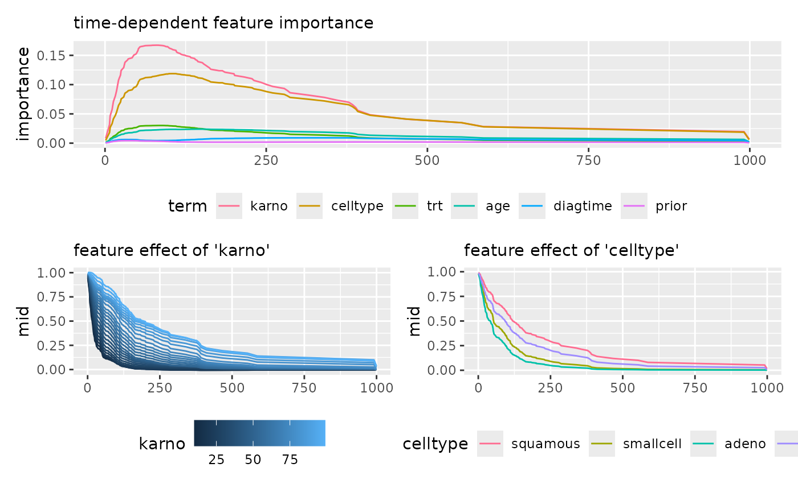
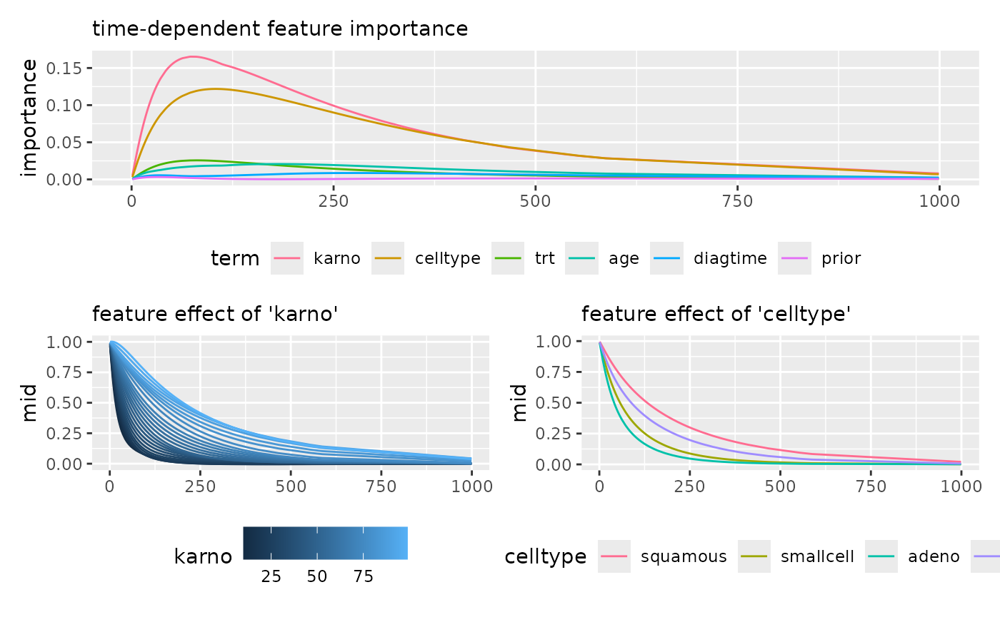
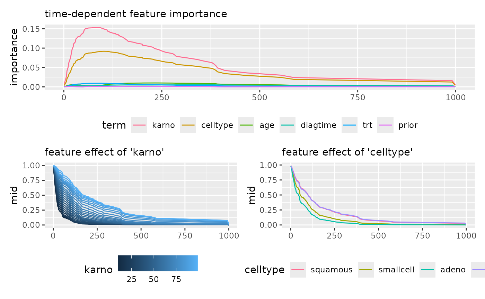
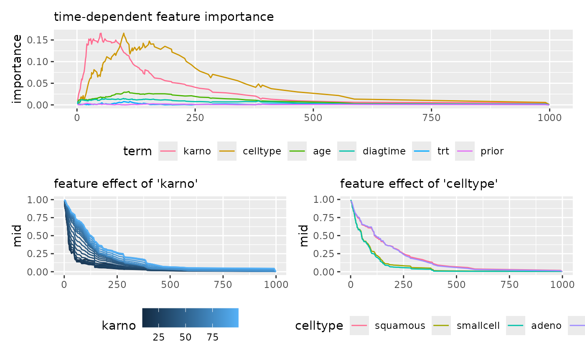

# Interpretation of Survival Models

This article presents examples of interpreting survival models using the
`midr` package.

As a fundamental approach to interpreting survival models, `midr` first
utilizes a prediction function to output a matrix of survival
probabilities, $Y_{it} = S_{t}\left( \mathbf{x}_{i} \right)$, for each
observation $i$ at each time point $t$, based on the `model` and the
`data` with the `pred.fun` (which defaults to
[`get.yhat()`](https://ryo-asashi.github.io/midr/reference/get.yhat.md)).
It then constructs a series of MID models targeting each column of this
predicted matrix (i.e., the survival probability for each survival time
$S_{t}$).

The resulting collection of models across multiple time points is
aggregated into an object of class “midrib”. This object is structured
to internally share computational resources, such as the design matrix
for the calculation of effects. This architecture enables the efficient
and smooth extraction of feature effects as they evolve over time.

``` r
# load required packages
library(midr)
library(ggplot2)
library(patchwork)
```

### Cox Proportional Hazard Model

``` r
library(survival)
fit_cox <- coxph(
  Surv(time, status) ~ .,
  data = veteran
)

mid_cox <- interpret(
  Surv(time, status) ~ .,
  data = veteran,
  model = fit_cox,
  lambda = .1
)

imp_cox <- mid.importance(mid_cox)

p1 <- ggmid(imp_cox, type = "series") +
  theme(legend.position = "bottom") +
  guides(color = guide_legend(nrow = 1)) +
  labs(subtitle = "time-dependent feature importance")
p2 <- ggmid(mid_cox, term = "karno", type = "series", intercept = TRUE) +
  theme(legend.position = "bottom") +
  labs(subtitle = "feature effect of 'karno'")
p3 <- ggmid(mid_cox, term = "celltype", type = "series", intercept = TRUE) +
  theme(legend.position = "bottom") +
  guides(color = guide_legend(nrow = 1)) +
  labs(subtitle = "feature effect of 'celltype'")

p1 / (p2 + p3)
```



### Parametric Survival Model

``` r
library(flexsurv)
fit_flex <- flexsurvreg(
  Surv(time, status) ~ .,
  data = veteran,
  dist = "weibull"
)

mid_flex <- interpret(
  Surv(time, status) ~ .,
  data = veteran,
  model = fit_flex,
  lambda = .1
)

imp_flex <- mid.importance(mid_flex)

p1 <- ggmid(imp_flex, type = "series") +
  theme(legend.position = "bottom") +
  guides(color = guide_legend(nrow = 1)) +
  labs(subtitle = "time-dependent feature importance")
p2 <- ggmid(mid_flex, term = "karno", type = "series", intercept = TRUE) +
  theme(legend.position = "bottom") +
  labs(subtitle = "feature effect of 'karno'")
p3 <- ggmid(mid_flex, term = "celltype", type = "series", intercept = TRUE) +
  theme(legend.position = "bottom") +
  guides(color = guide_legend(nrow = 1)) +
  labs(subtitle = "feature effect of 'celltype'")

p1 / (p2 + p3)
```



### Model Based Boosting

``` r
library(mboost)
fit_mboost <- glmboost(
  Surv(time, status) ~ .,
  data = veteran,
  family = CoxPH()
)

mid_mboost <- interpret(
  Surv(time, status) ~ .,
  data = veteran,
  model = fit_mboost,
  lambda = .1
)

imp_mboost <- mid.importance(mid_mboost)

p1 <- ggmid(imp_mboost, type = "series") +
  theme(legend.position = "bottom") +
  guides(color = guide_legend(nrow = 1)) +
  labs(subtitle = "time-dependent feature importance")
p2 <- ggmid(mid_mboost, term = "karno", type = "series", intercept = TRUE) +
  theme(legend.position = "bottom") +
  labs(subtitle = "feature effect of 'karno'")
p3 <- ggmid(mid_mboost, term = "celltype", type = "series", intercept = TRUE) +
  theme(legend.position = "bottom") +
  guides(color = guide_legend(nrow = 1)) +
  labs(subtitle = "feature effect of 'celltype'")

p1 / (p2 + p3)
```



### Random Survival Forest

``` r
library(randomForestSRC)
fit_rsf <- rfsrc(
  Surv(time, status) ~ .,
  data = veteran
)

mid_rsf <- interpret(
  Surv(time, status) ~ .,
  data = veteran,
  model = fit_rsf,
  lambda = .1
)

imp_rsf <- mid.importance(mid_rsf)

p1 <- ggmid(imp_rsf, type = "series") +
  theme(legend.position = "bottom") +
  guides(color = guide_legend(nrow = 1)) +
  labs(subtitle = "time-dependent feature importance")
p2 <- ggmid(mid_rsf, term = "karno", type = "series", intercept = TRUE) +
  theme(legend.position = "bottom") +
  labs(subtitle = "feature effect of 'karno'")
p3 <- ggmid(mid_rsf, term = "celltype", type = "series", intercept = TRUE) +
  theme(legend.position = "bottom") +
  guides(color = guide_legend(nrow = 1)) +
  labs(subtitle = "feature effect of 'celltype'")

p1 / (p2 + p3)
```



### Oblique Random Survival Forest

``` r
library(aorsf)
fit_orsf <- orsf(
  Surv(time, status) ~ .,
  data = veteran
)

mid_orsf <- interpret(
  Surv(time, status) ~ .,
  data = veteran,
  model = fit_orsf,
  lambda = .1
)

imp_orsf <- mid.importance(mid_orsf)

p1 <- ggmid(imp_orsf, type = "series") +
  theme(legend.position = "bottom") +
  guides(color = guide_legend(nrow = 1)) +
  labs(subtitle = "time-dependent feature importance")
p2 <- ggmid(mid_orsf, term = "karno", type = "series", intercept = TRUE) +
  theme(legend.position = "bottom") +
  labs(subtitle = "feature effect of 'karno'")
p3 <- ggmid(mid_orsf, term = "celltype", type = "series", intercept = TRUE) +
  theme(legend.position = "bottom") +
  guides(color = guide_legend(nrow = 1)) +
  labs(subtitle = "feature effect of 'celltype'")

p1 / (p2 + p3)
```


